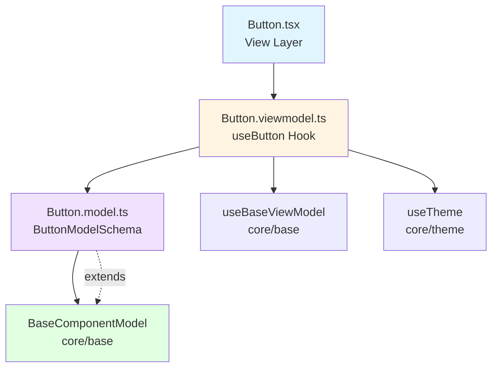

<p align="center">
  
</p>

<h1 align="center">Ark.Alliance.React.Component.UI</h1>
<h2 align="center">Button Component</h2>

<p align="center">
  <strong>Versatile button component with multiple variants, sizes, async support, and comprehensive theming.</strong>
</p>

---

**Author:** Armand Richelet-Kleinberg with the assistance of Anthropic Claude Opus 4.5

---

## Overview

The Button component is a flexible, accessible button supporting multiple visual variants, sizes, loading states, icons, and async click handlers. Built following the MVVM pattern with separated Model, ViewModel, and View layers.

## Features

- ✨ **Rich Variants** - Primary, secondary, ghost, outline, danger, success, link, neon
- 📐 **Size Options** - xs, sm, md, lg, xl
- 🔄 **Async Support** - Automatic loading state for async onClick handlers  
- 🎨 **Icon Support** - Left, right, center, or icon-only modes
- 🎯 **Full Width** - Optional full-width button layout
- 💊 **Pill Shape** - Fully rounded button style
- ♿ **Accessible** - ARIA compliant with keyboard support
- 🎨 **Theme Aware** - Dark/light mode with CSS variables
- ⚡ **Event System** - Integrated event channel for state management

---

## Architecture



### MVVM Pattern
- **Model** (`Button.model.ts`): Zod schema validation, type definitions
- **ViewModel** (`Button.viewmodel.ts`): Business logic, state management, event handlers
- **View** (`Button.tsx`): Pure presentational React component

### Base Component Integration
✅ **Extends**: `BaseComponentModel` via `extendSchema()`  
✅ **ViewModel**: Uses `useBaseViewModel` for state/events  
✅ **Theme**: Integrated via `useTheme()` hook

---

## Usage Examples

### Basic Usage

```typescript
import { Button } from '@/components/Buttons/Button';

<Button variant="primary" size="md">
  Click Me
</Button>
```

### With Icons

```typescript
<Button 
  variant="primary" 
  iconLeft="check"
  iconRight="arrow-right"
>
  Save and Continue
</Button>

{/* Icon-only button */}
<Button 
  variant="ghost" 
  iconCenter="settings"
  iconOnly
  ariaLabel="Settings"
/>
```

### Async Click Handler

```typescript
<Button
  variant="primary"
  onClick={async () => {
    await saveData();
    // Loading state handled automatically
  }}
>
  Save
</Button>
```

### Full Width & Pill Style

```typescript
<Button 
  variant="primary"
  size="lg"
  fullWidth
  pill
>
  Submit Form
</Button>
```

### Custom Styling

```typescript
<Button
  variant="outline"
  className="custom-button"
  style={{ borderRadius: '8px' }}
  disabled={isProcessing}
  testId="submit-btn"
>
  Custom Button
</Button>
```

---

## Properties

### ButtonProps

| Property | Type | Default | Description |
|----------|------|---------|-------------|
| `variant` | `ButtonVariantType` | `'primary'` | Visual variant style |
| `size` | `ButtonSizeType` | `'md'` | Button size |
| `type` | `'button' \| 'submit' \| 'reset'` | `'button'` | HTML button type |
| `fullWidth` | `boolean` | `false` | Fill parent container width |
| `pill` | `boolean` | `false` | Fully rounded pill shape |
| `iconLeft` | `string` | `undefined` | Icon name for left position |
| `iconLeftElement` | `ReactElement` | `undefined` | Custom React element (left) |
| `iconRight` | `string` | `undefined` | Icon name for right position |
| `iconRightElement` | `ReactElement` | `undefined` | Custom React element (right) |
| `iconCenter` | `string` | `undefined` | Icon name for center (icon-only) |
| `iconOnly` | `boolean` | `false` | Icon-only button mode |
| `iconColor` | `string` | `undefined` | Custom icon color (CSS value) |
| `iconColorDisabled` | `string` | `undefined` | Icon color when disabled |
| `isDark` | `boolean` | auto-detected | Dark mode override |
| `disabled` | `boolean` | `false` | Disable button interaction |
| `loading` | `boolean` | `false` | Loading state (managed automatically for async onClick) |
| `className` | `string` | `''` | Additional CSS classes |
| `style` | `CSSProperties` | `{}` | Inline styles |
| `testId` | `string` | `undefined` | Test identifier |
| `ariaLabel` | `string` | `undefined` | ARIA label for accessibility |
| `onClick` | `(e) => void \| Promise<void>` | `undefined` | Click handler (supports async) |
| `onFocus` | `(e) => void` | `undefined` | Focus event handler |
| `onBlur` | `(e) => void` | `undefined` | Blur event handler |
| `onKeyDown` | `(e) => void` | `undefined` | Keyboard event handler |
| `children` | `ReactNode` | `undefined` | Button content/label |

### ButtonVariantType
`'primary' | 'secondary' | 'ghost' | 'outline' | 'danger' | 'success' | 'link' | 'neon'`

### ButtonSizeType  
`'xs' | 'sm' | 'md' | 'lg' | 'xl'`

---

## Methods (ViewModel)

The `useButton` hook provides:

| Method | Parameters | Returns | Description |
|--------|------------|---------|-------------|
| `handleClick` | `event: MouseEvent` | `void` | Click handler with async support & loading state |
| `handleFocus` | `event: FocusEvent` | `void` | Focus handler with event emission |
| `handleBlur` | `event: FocusEvent` | `void` | Blur handler with event emission |
| `handleKeyDown` | `event: KeyboardEvent` | `void` | Keyboard handler for Enter/Space |
| `isInteractive` | - | `boolean` | Computed: is button clickable (not disabled/loading) |
| `buttonClasses` | - | `string` | Computed CSS classes based on state |

---

## Dependencies

### Primitive Components
- `Icon` (from `@/components/Icon`) - For rendering icons

### Core Modules
- `core/base`:
  - `extendSchema` - Schema extension utility
  - `useBaseViewModel` - Base ViewModel hook  
  - `BaseModel` - Base model type
- `core/theme`:
  - `useTheme` - Theme context hook

### External Libraries
- `zod` - Schema validation
- `react` - Component framework

---

## Theming

The Button uses CSS variables for theming:

```scss
.ark-btn {
  // Override in your theme
  --ark-accent-500: #your-primary;
  --ark-accent-600: #your-hover;
  --ark-accent-700: #your-active;
  --ark-bg-card: #your-bg;
  --ark-text-primary: #your-text;
  --ark-border-default: #your-border;
}
```

### Variant-Specific Variables
Each variant (`primary`, `secondary`, etc.) has dedicated CSS variable overrides in `Button.scss`.

### Light/Dark Mode
Automatically adapts via `isDark` prop or theme context. Classes: `ark-btn--dark` / `ark-btn--light`

---

## Accessibility Features

### ARIA Support
- `aria-label` for icon-only buttons
- `aria-busy` during loading state  
- `aria-disabled` when disabled
- `role="button"` (implicit via `<button>` element)

### Keyboard Support
- **Enter/Space**: Activates button
- Emits `keyActivate` event on Enter/Space press

### Focus Management
- Focusable when not disabled
- Focus/blur events tracked and emitted

### WCAG 2.1 AA Touch Target Compliance

**Minimum Size Requirement:** 44x44 pixels

All buttons enforce a baseline `min-width: 44px` and `min-height: 44px` to meet WCAG 2.1 Level AA success criterion [2.5.5 Target Size](https://www.w3.org/WAI/WCAG21/Understanding/target-size.html).

#### Size Compliance

| Size | Dimensions | Touch Compliant | Desktop Only |
|------|-----------|----------------|--------------|
| `xs` | 12px padding | ⚠️ 44px enforced | Desktop recommended |
| `sm` | 16px padding | ⚠️ 44px enforced | Desktop recommended |
| `md` | 20px padding | ⚠️ 44px enforced | Desktop recommended |
| `lg` | 24px (48px min) | ✅ Yes | All contexts |
| `xl` | 32px (56px min) | ✅ Yes | All contexts |

**Recommendations:**
- **Touch Interfaces** (mobile, tablets): Use `size="lg"` or `size="xl"`
- **Desktop Only** (data tables, dense toolbars): `xs`, `sm`, `md` acceptable
- **Hybrid Apps**: Default to `size="lg"` for primary actions

**Note:** The 44px baseline ensures even small buttons meet minimum touch target requirements, but larger sizes provide better usability on touch devices.

---

## Browser Support

- ✅ Chrome/Edge 90+
- ✅ Firefox 88+
- ✅ Safari 14+
- ✅ iOS Safari 14+
- ✅ Android Chrome 90+

---

## Performance Considerations

1. **Async Optimization**: Automatic loading state prevents double-clicks
2. **Memoization**: Uses `useMemo` for buttonClasses computation
3. **Event Callbacks**: Uses `useCallback` for stable references

---

## Testing

```typescript
import { render, screen, fireEvent } from '@testing-library/react';
import { Button } from './Button';

test('calls onClick handler', () => {
  const handleClick = vi.fn();
  render(<Button onClick={handleClick}>Click Me</Button>);
  
  fireEvent.click(screen.getByRole('button'));
  expect(handleClick).toHaveBeenCalledTimes(1);
});

test('shows loading state for async onClick', async () => {
  const asyncClick = vi.fn(async () => {
    await new Promise(r => setTimeout(r, 100));
  });
  
  render(<Button onClick={asyncClick}>Save</Button>);
  
  fireEvent.click(screen.getByRole('button'));
  expect(screen.getByRole('button')).toHaveClass('ark-btn--loading');
});

test('is disabled when disabled prop is true', () => {
  render(<Button disabled>Disabled</Button>);
  expect(screen.getByRole('button')).toBeDisabled();
});
```

---

## Recommended Improvements

### ✅ Enum Consolidation - COMPLETE

**Status**: ✅ **FIXED - Using Core Enums!**

The Button component has been successfully refactored to use core enums:

```typescript
// Button.model.ts - NOW USING CORE ENUMS ✅
import { ButtonVariantSchema, ComponentSizeSchema } from '@core/enums';

variant: ButtonVariantSchema.default('primary'),  // ✅ From core/enums
size: ComponentSizeSchema.default('md'),           // ✅ From core/enums
```

**What Changed**:
- ✅ Removed custom `ButtonVariant` enum
- ✅ Removed custom `ButtonSize` enum  
- ✅ Added 'neon' + 'link' variants to `ButtonVariantSchema` in `@core/enums`
- ✅ Now uses `ComponentSizeSchema` (xs, sm, md, lg, xl)

**Benefits**:
- Single source of truth for button variants across library
- Consistent sizing with all other components
- Easier to add new variants globally
- Better TypeScript autocomplete

---

### 🎨 Theme Integration

**Recommendation**: Add theme hook for automatic dark/light detection

**Current Approach**:
```typescript
// Manual prop
<Button isDark={darkMode} />
```

**Recommended Approach**:
```typescript
// Automatic theme detection
import { useTheme } from '@core/theme';

export function useButton(options) {
  const { resolvedMode } = useTheme();
  const isDark = options.isDark ?? (resolvedMode === 'dark');
  // ...
}
```

**Benefits**:
- Automatic theme switching
- Reduces boilerplate
- Consistent with other components

**Impact**: Reduces code duplication, ensures consistency across components.

---

### 💾 CookieHelper Integration

**Opportunity**: User button preferences persistence

**Recommended Implementation**:
```typescript
// Button.viewmodel.ts - ADD
import { usePersistentState } from '@/Helpers/Storage/CookieHelper';

export function use Button(options) {
  // Persist user's preferred button size globally
  const [preferredSize, setPreferredSize] = usePersistentState(
    'ark-button-preferred-size',
    'md'
  );
  
  const size = options.size || preferredSize;
  
  // Track size preferences when explicitly set
  useEffect(() => {
    if (options.size) {
      setPreferredSize(options.size);
    }
  }, [options.size]);
  
  // ...
}
```

**Use Cases**:
- Remember user's preferred button size across sessions
- Persist theme preference (dark/light) per user
- Track frequently used variants for analytics

---

### 🔍 SEO Support

**Current State**: ❌ No SEO metadata integration

**Recommendation**: Not applicable - Button is a UI interaction component, not a content/layout component. SEO support appropriate for Page, Article, Card components with semantic content.

---

### 🎨 Theme Enhancement

**Current State**:  
✅ Supports dark/light mode  
✅ Uses CSS variables  
✅ Auto-detects theme via `useTheme()`

**Potential Enhancement**:
```typescript
// Support custom theme variants beyond dark/light
export const ButtonTheme = z.enum(['default', 'high-contrast', 'colorblind']);

// In viewmodel
const { theme, resolvedMode } = useTheme();
const themeVariant = base.model.themeVariant || theme.variant || 'default';
```

**Benefit**: Accessibility for colorblind users, high-contrast modes.

---

### ⚡ Additional Enhancements

1. **Ripple Effect**: Add Material Design-style ripple animation on click
2. **Tooltip Integration**: Auto-show tooltip for icon-only buttons if `ariaLabel` present
3. **Loading Text**: Support `loadingText` prop to customize loading state label
4. **Group Support**: Create `ButtonGroup` wrapper for grouped buttons with shared styling

---

## Copyright & License

<p align="center">
  <strong>M2H.IO © 2022 - 2026 • Ark.Alliance Ecosystem</strong><br/>
  <sub>Armand Richelet-Kleinberg</sub>
</p>

<p align="center">
  Part of the <strong>Ark.Alliance.React.Component.UI</strong> library<br/>
  Enterprise-grade React components for the Ark Alliance Ecosystem
</p>
