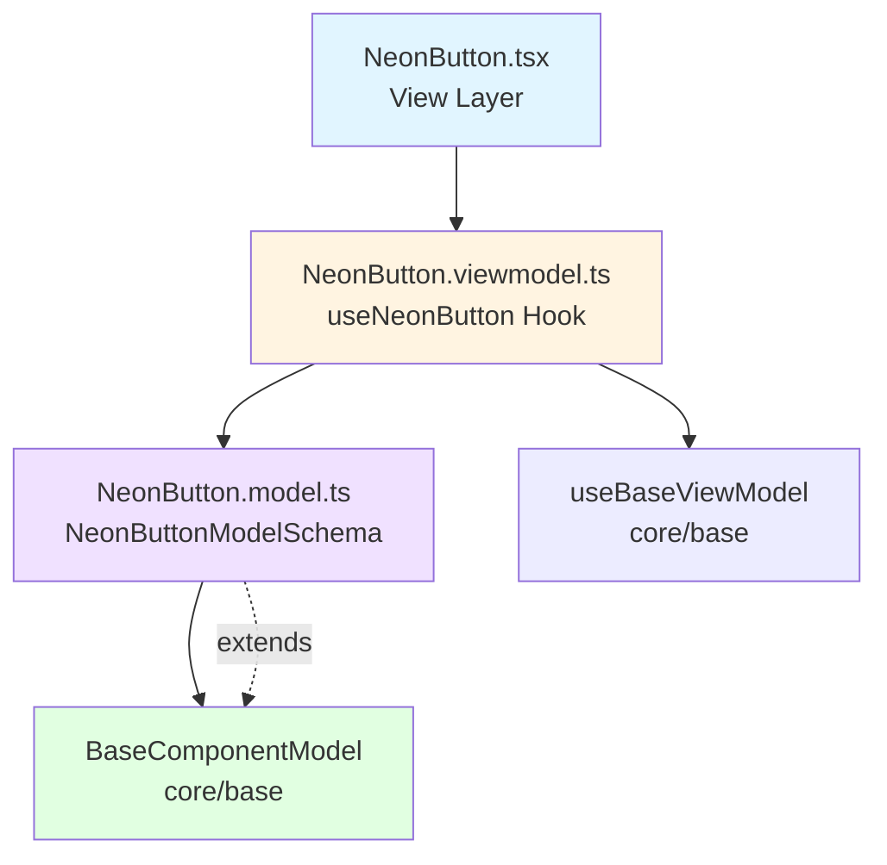

<p align="center">
  
</p>

<h1 align="center">Ark.Alliance.React.Component.UI</h1>
<h2 align="center">NeonButton Component</h2>

<p align="center">
  <strong>Premium button with neon glow effect and theme-aware gradients.</strong>
</p>

---

**Author:** Armand Richelet-Kleinberg with the assistance of Anthropic Claude Opus 4.5

---

> [!WARNING]
> **Deprecated**: This component is deprecated. Use `Button` with `variant="neon"` instead for the same visual effect with full Button API support.

---

## Overview

The NeonButton component provides a premium button with animated neon glow effects, custom gradients, and smooth hover/press transitions. Built following MVVM pattern.

## Features

- ✨ **Neon Glow** - Animated text and border glow effects
- 🎨 **Theme Gradients** - Background gradients adapt to dark/light mode  
- 🖱️ **Hover Effects** - Smooth color transitions on hover/press
- 📐 **Size Variants** - xs, sm, md, lg, xl
- 🎯 **Color Variants** - primary, success, danger, warning, ghost
- ⚡ **Loading State** - Built-in loading spinner
- ♿ **Accessible** - ARIA compliant
- 🎨 **Theme Aware** - Automatic dark/light mode adaptation

---

## Architecture



### MVVM Pattern
- **Model** (`NeonButton.model.ts`): Zod schema validation
- **ViewModel** (`NeonButton.viewmodel.ts`): Business logic, computed styles, hover/press state
- **View** (`NeonButton.tsx`): Pure presentational component

### Base Component Integration
✅ **Extends**: `BaseComponentModel` via `extendSchema()`  
✅ **ViewModel**: Uses `useBaseViewModel`  
❌ **Theme**: Does not use `useTheme()` (uses custom gradient logic)

---

## Usage Examples

### Basic Usage

```typescript
import { NeonButton } from '@/components/Buttons/NeonButton';

<NeonButton variant="primary">
  Click Me
</NeonButton>
```

### With Icon

```typescript
<NeonButton 
  variant="success"
  icon={<CheckIcon />}
>
  Submit
</NeonButton>
```

### Full Width & Sizes

```typescript
<NeonButton size="lg" fullWidth>
  Large Full Width
</NeonButton>

<NeonButton size="sm">
  Small Button
</NeonButton>
```

### Loading State

```typescript
<NeonButton 
  loading={isProcessing}
  disabled={isProcessing}
>
  {isProcessing ? 'Processing...' : 'Submit'}
</NeonButton>
```

---

## Properties

### NeonButtonProps

| Property | Type | Default | Description |
|----------|------|---------|-------------|
| `variant` | `NeonButtonVariantType` | `'primary'` | Neon color variant |
| `size` | `NeonButtonSizeType` | `'md'` | Button size |
| `type` | `'button' \| 'submit' \| 'reset'` | `'button'` | HTML button type |
| `fullWidth` | `boolean` | `false` | Fill parent container width |
| `isDark` | `boolean` | `true` | Dark mode (affects gradient background) |
| `disabled` | `boolean` | `false` | Disable button interaction |
| `loading` | `boolean` | `false` | Show loading spinner |
| `icon` | `ReactNode` | `undefined` | Optional icon (left side) |
| `children` | `ReactNode` | required | Button content/label |
| `className` | `string` | `''` | Additional CSS classes |
| `onClick` | `(e) => void` | `undefined` | Click event handler |
| `testId` | `string` | `undefined` | Test identifier |
| `ariaLabel` | `string` | `undefined` | ARIA label for accessibility |

### NeonButtonVariantType
`'primary' | 'success' | 'danger' | 'warning' | 'ghost'`

### NeonButtonSizeType  
`'xs' | 'sm' | 'md' | 'lg' | 'xl'`

---

## Methods (ViewModel)

The `useNeonButton` hook provides:

| Method/Property | Type | Description |
|-----------------|------|-------------|
| `setHovered` | `(val: boolean) => void` | Update hover state |
| `setPressed` | `(val: boolean) => void` | Update press state |
| `bgGradient` | `string` | Computed background gradient (CSS) |
| `borderColor` | `string` | Computed border color |
| `textShadow` | `string` | Computed neon text glow effect |
| `boxShadow` | `string` | Computed neon box shadow |
| `transform` | `string` | Computed transform (press animation) |
| `variantStyles` | `object` | Color/glow values for current variant |

---

## Dependencies

### Primitive Components
None - self-contained visual component

### Core Modules
- `core/base`:
  - `extendSchema` - Schema extension utility
  - `useBaseViewModel` - Base ViewModel hook
- `core/constants`:
  - `SIZE_CLASSES` - Shared size class mapping

### External Libraries
- `zod` - Schema validation
- `react` - Component framework

---

## Theming

The NeonButton generates dynamic inline styles based on variant and state:

### Variant Colors

```typescript
// Defined in NeonButton.viewmodel.ts
const VARIANT_COLORS = {
  primary: { color: '#00d9ff', glow: 'rgba(0, 217, 255, 0.6)' },
  success: { color: '#00ff88', glow: 'rgba(0, 255, 136, 0.6)' },
  danger: { color: '#ff0055', glow: 'rgba(255, 0, 85, 0.6)' },
  warning: { color: '#ffaa00', glow: 'rgba(255, 170, 0, 0.6)' },
  ghost: { color: '#ffffff', glow: 'rgba(255, 255, 255, 0.4)' },
};
```

### Dark/Light Mode
- **Dark**: Black gradient background
- **Light**: White gradient background
- Controlled via `isDark` prop (defaults to `true`)

---

## Accessibility Features

### ARIA Support
- `aria-label` for custom labels
- `aria-busy` during loading state
- `disabled` attribute when disabled/loading

### Visual Feedback
- Hover state with color intensity
- Press state with scale transform
- Loading spinner replaces content

---

## Browser Support

- ✅ Chrome/Edge 90+
- ✅ Firefox 88+
- ✅ Safari 14+
- ✅ iOS Safari 14+
- ✅ Android Chrome 90+

Requires support for CSS `text-shadow`, `box-shadow`, and `transform`.

---

## Performance Considerations

1. **Inline Styles**: Computed styles are generated in ViewModel (memoized)
2. **State Management**: Hover/press state use `useState` for real-time updates
3. **Animations**: CSS transforms (GPU accelerated)

---

## Testing

```typescript
import { render, screen, fireEvent } from '@testing-library/react';
import { NeonButton } from './NeonButton';

test('renders with neon glow effect', () => {
  render(<NeonButton>Glow Button</NeonButton>);
  const button = screen.getByRole('button');
  expect(button).toHaveStyle({ textShadow: expect.stringContaining('0 0') });
});

test('updates state on hover', () => {
  render(<NeonButton>Hover Me</NeonButton>);
  const button = screen.getByRole('button');
  
  fireEvent.mouseEnter(button);
  // Assert hover styles applied
});

test('shows loading spinner when loading', () => {
  render(<NeonButton loading>Submit</NeonButton>);
  expect(screen.getByRole('button')).toHaveAttribute('aria-busy', 'true');
});
```

---

## Recommended Improvements

### ⚠️ Deprecation Path

**Current State**: Component marked as `@deprecated`

**Recommendation**: Complete migration path to Button component:

```typescript
// BEFORE (NeonButton)
<NeonButton variant="primary" size="lg" fullWidth>
  Click Me
</NeonButton>

// AFTER (Button with neon variant)
<Button variant="neon" size="lg" fullWidth>
  Click Me
</Button>
```

**Migration Steps**:
1. Update all `<NeonButton>` usages to `<Button variant="neon">`
2. Remove icon prop (use Button's `iconLeft` or `iconRight`)
3. Archive NeonButton component after migration complete

---

### 🔄 Enum Consolidation

**Current State**: Duplicates size enum

```typescript
// NeonButton.model.ts - LOCAL enum
export const NeonButtonSize = z.enum(['xs', 'sm', 'md', 'lg', 'xl']);

// Should use:
import { ComponentSizeSchema } from '@core/enums';
```

**Impact**: Reduces duplication, matches Button component pattern (once migrated to Button, this is moot)

---

### 🎨 Theme Integration

**Current State**: ❌ Does not use `useTheme()` hook

**Recommendation**: Integrate with theme system

```typescript
// NeonButton.viewmodel.ts - ADD
import { useTheme } from '@core/theme';

export function useNeonButton(options) {
  const { resolvedMode } = useTheme();
  const isDark = options.isDark ?? (resolvedMode === 'dark');
  
  // Use theme-aware isDark value
}
```

**Benefit**: Automatic theme synchronization across app

---

### 💾 CookieHelper Integration

**Opportunity**: N/A - Component is deprecated, no persistence needed

---

### 🔍 SEO Support

**Current State**: Not applicable - UI interaction component

---

### ⚡ Post-Deprecation

Once fully deprecated, consider:
1. **Archive**: Move to `/deprecated` folder
2. **Remove**: Delete after 2-3 major versions
3. **Document**: Add migration guide to main Button README

---

## Copyright & License

<p align="center">
  <strong>M2H.IO © 2022 - 2026 • Ark.Alliance Ecosystem</strong><br/>
  <sub>Armand Richelet-Kleinberg</sub>
</p>

<p align="center">
  Part of the <strong>Ark.Alliance.React.Component.UI</strong> library<br/>
  Enterprise-grade React components for the Ark Alliance Ecosystem
</p>
