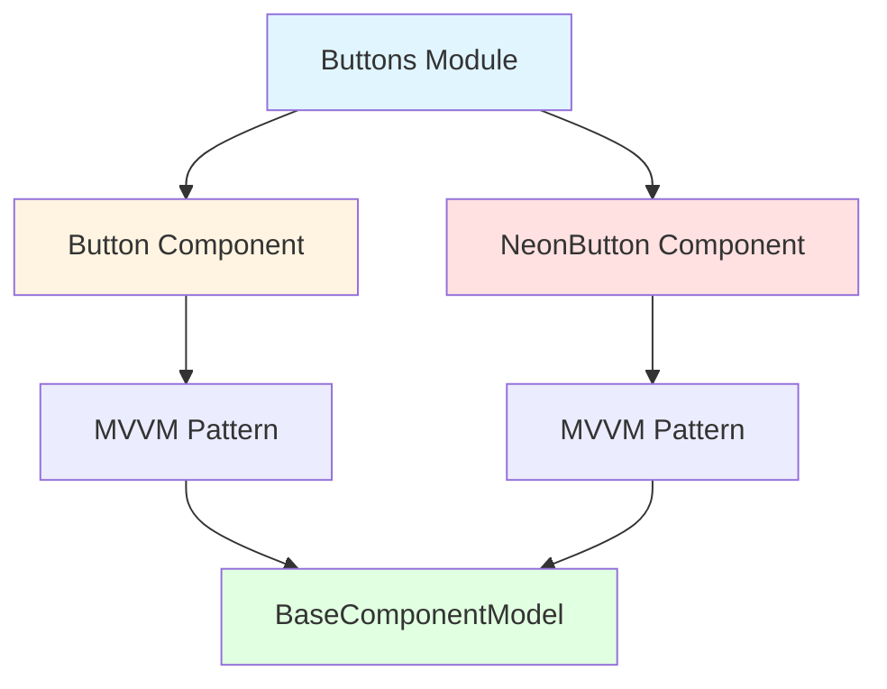

<p align="center">
  
</p>

<h1 align="center">Ark.Alliance.React.Component.UI</h1>
<h2 align="center">Buttons Module</h2>

<p align="center">
  <strong>Collection of button components with various styles and behaviors.</strong>
</p>

---

**Author:** Armand Richelet-Kleinberg with the assistance of Anthropic Claude Opus 4.5

---

## Overview

The Buttons module provides a comprehensive collection of button components for user interactions. All components follow MVVM architecture and extend `BaseComponentModel`.

## Components

### [Button](./Button/README.md)
Primary button component with rich variant/size support, async handling, and icon integration.

**Key Features**:
- 8 variants: primary, secondary, ghost, outline, danger, success, link, neon
- 5 sizes: xs, sm, md, lg, xl
- Async onClick with automatic loading state
- Icon left/right/center positioning
- Full accessibility support

### [NeonButton](./NeonButton/README.md) ⚠️ Deprecated
Premium button with neon glow effects and custom gradients.

> [!WARNING]  
> **Deprecated**: Use `Button` with ` variant="neon"` instead.

---

## Usage

```typescript
import { Button } from '@/components/Buttons';

// Primary action
<Button variant="primary" onClick={handleSubmit}>
  Submit
</Button>

// With icon
<Button variant="outline" iconLeft="save">
  Save Draft
</Button>

// Async operation
<Button onClick={async () => await saveData()}>
  Async Save
</Button>
```

---

## Common Improvements

All button components share these architectural recommendations:

### 🔄 Enum Consolidation
- **Current**: Local `ButtonSize`, `ButtonVariant`, `NeonButtonSize` enums
- **Recommended**: Use `ComponentSizeSchema` and `ButtonVariantSchema` from `@core/enums`

### 💾 CookieHelper Integration
- Persist user preferred button sizes
- Remember theme preferences per-session
- Track variant usage analytics

### 🎨 Theme Support
- ✅ Both components support dark/light mode
- ✅ Use CSS variables for theming
- Potential: Custom theme variants (high-contrast, colorblind modes)

---

## Architecture



---

## Copyright & License

<p align="center">
  <strong>M2H.IO © 2022 - 2026 • Ark.Alliance Ecosystem</strong><br/>
  <sub>Armand Richelet-Kleinberg</sub>
</p>

<p align="center">
  Part of the <strong>Ark.Alliance.React.Component.UI</strong> library<br/>
  Enterprise-grade React components for the Ark Alliance Ecosystem
</p>
