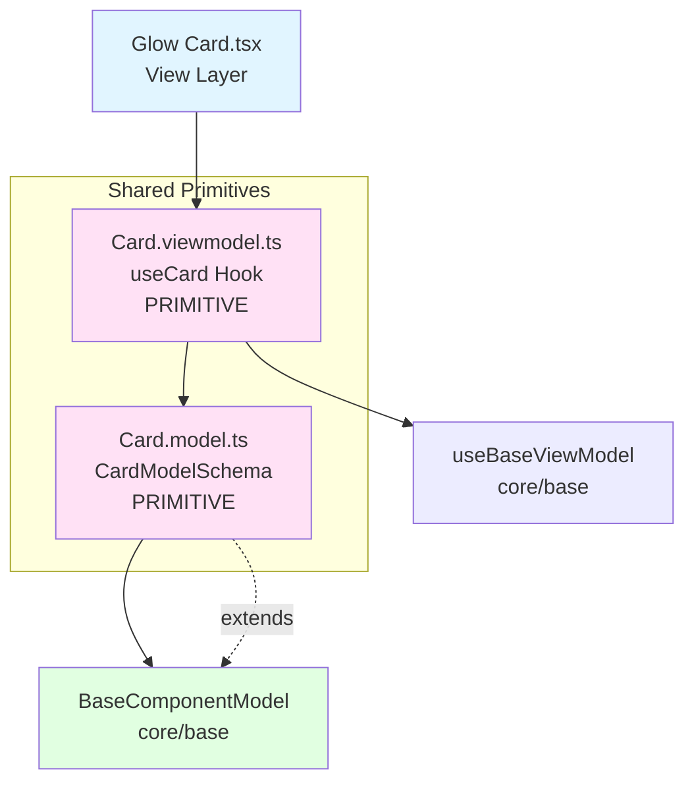

<p align="center">
  
</p>

<h1 align="center">Ark.Alliance.React.Component.UI</h1>
<h2 align="center">GlowCard Component</h2>

<p align="center">
  <strong>Premium card with status-based glow effects and flexible content layout.</strong>
</p>

---

**Author:** Armand Richelet-Kleinberg with the assistance of Anthropic Claude Opus 4.5

---

## Overview

The GlowCard component is a premium card implementation with status-based border and glow effects. Built on shared `Card` primitive (model + viewmodel), it provides a flexible, theme-aware container for content.

## Features

- ✨ **Status-Based Styling** - idle, success, warning, error, info
- 🎨 **Hover Glow Effect** - Animated glow on hover  
- 🔧 **Flexible Layout** - Optional header, icon, actions
- 📐 **Compact Mode** - Reduced padding variant
- 🎯 **Clickable** - Optional click handler with keyboard support
- ♿ **Accessible** - ARIA roles, keyboard navigation
- 🎨 **Theme Aware** - Dark/light mode color adaptation
- 🏗️ **Primitive Pattern** - Uses shared Card model/viewmodel

---

## Architecture



### MVVM Pattern with Primitive Sharing
- **Primitive Model** (`Card.model.ts`): Shared schema for all card variants
- **Primitive ViewModel** (`Card.viewmodel.ts`): Shared business logic (`useCard` hook)
- **View** (`GlowCard.tsx`): Specific visual implementation

### Base Component Integration
✅ **Extends**: `BaseComponentModel` via `extendSchema()`  
✅ **ViewModel**: Uses `useBaseViewModel` + `useCard` primitive  
✅ **Theme**: Theme-aware via `isDark` prop (not `useTheme()`)

---

## Usage Examples

### Basic Usage

```typescript
import { GlowCard } from '@/components/Cards/GlowCard';

<GlowCard title="System Status" status="success">
  All systems operational
</GlowCard>
```

### With Icon and Actions

```typescript
<GlowCard 
  title="Alerts"
  status="warning"
  icon={<AlertIcon />}
  headerActions={
    <Button size="sm" variant="ghost">View All</Button>
  }
>
  3 pending alerts require attention
</GlowCard>
```

### Clickable Card

```typescript
<GlowCard
  title="Dashboard"
  subtitle="Analytics"
  status="info"
  clickable
  onClick={() => navigate('/dashboard')}
>
  Click to view dashboard
</GlowCard>
```

### Compact Mode

```typescript
<GlowCard 
  title="Quick Stats"
  status="idle"
  compact
>
  Compact content area
</GlowCard>
```

---

## Properties

### GlowCardProps

| Property | Type | Default | Description |
|----------|------|---------|-------------|
| `title` | `string` | required | Card title (required) |
| `subtitle` | `string` | `undefined` | Optional subtitle below title |
| `status` | `CardStatusType` | `'idle'` | Status for border/glow color |
| `variant` | `CardVariantType` | `'default'` | Visual variant style |
| `compact` | `boolean` | `false` | Reduced padding mode |
| `showHeader` | `boolean` | `true` | Show header section |
| `icon` | `ReactNode` | `undefined` | Optional icon element (left of title) |
| `headerActions` | `ReactNode` | `undefined` | Optional actions (right of header) |
| `children` | `ReactNode` | required | Card body content |
| `clickable` | `boolean` | `false` | Enable click interaction |
| `onClick` | `() => void` | `undefined` | Click handler |
| `isDark` | `boolean` | `true` | Dark mode styling |
| `glowColor` | `string` | auto | Custom glow color (CSS value) |
| `borderColor` | `string` | auto | Custom border color (CSS value) |
| `className` | `string` | `''` | Additional CSS classes |
| `testId` | `string` | `undefined` | Test identifier |

### CardStatusType  
`'idle' | 'success' | 'warning' | 'error' | 'info'`

### CardVariantType
`'default' | 'glass' | 'bordered' | 'elevated' | 'scanner' | 'hologram'`

---

## Methods (Primitive ViewModel)

The shared `useCard` hook provides:

| Method/Property | Type | Description |
|-----------------|------|-------------|
| `handleClick` | `() => void` | Handle card click with event emission |
| `isHovered` | `boolean` | Current hover state |
| `setIsHovered` | `(val: boolean) => void` | Update hover state |
| `cardClasses` | `string` | Computed CSS classes |
| `cardStyles` | `CSSProperties` | Computed inline styles (border, shadow) |
| `headerClasses` | `string` | Header CSS classes |
| `bodyClasses` | `string` | Body CSS classes |
| `borderColor` | `string` | Current border color |
| `glowColor` | `string` | Current glow color |

---

## Dependencies

### Primitive Components
- **`Card.model.ts`** - Shared schema definition (PRIMITIVE)
- **`Card.viewmodel.ts`** - Shared business logic (`useCard` hook) (PRIMITIVE)

### Core Modules
- `core/base`:
  - `extendSchema` - Schema extension utility
  - `useBaseViewModel` - Base ViewModel hook
- `core/constants`:
  - Status color configurations

### External Libraries
- `zod` - Schema validation
- `react` - Component framework

---

## Theming

The GlowCard uses status-based color configurations from `Card.model.ts`:

### Status Colors

```typescript
// Defined in CARD_STATUS_CONFIG
const statusColors = {
  idle: { borderDark: '#1f2937', glowDark: 'rgba(59,130,246,0.15)' },
  success: { borderDark: '#22c55e', glowDark: 'rgba(34,197,94,0.15)' },
  warning: { borderDark: '#eab308', glowDark: 'rgba(234,179,8,0.15)' },
  error: { borderDark: '#ef4444', glowDark: 'rgba(239,68,68,0.15)' },
  info: { borderDark: '#3b82f6', glowDark: 'rgba(59,130,246,0.20)' },
};
```

### Dark/Light Mode
- **Dark**: Uses `borderDark`, `glowDark` from config
- **Light**: Uses `borderLight`, `glowLight` from config
- Controlled via `isDark` prop (defaults to `true`)

### Custom Colors
Override status colors with props:
```typescript
<GlowCard
  borderColor="#custom-border"
  glowColor="rgba(255,0,0,0.3)"
>
```

---

## Accessibility Features

### ARIA Support
- `role="button"` when clickable
- `aria-label` for clickable cards (defaults to title)
- `tabIndex={0}` for keyboard focus when clickable

### Keyboard Support
- **Enter/Space**: Activates onClick handler
- Focus indicator with visible outline

### Visual Feedback
- Hover state with glow effect
- Click state handled by browser default

---

## Browser Support

- ✅ Chrome/Edge 90+
- ✅ Firefox 88+
- ✅ Safari 14+
- ✅ iOS Safari 14+
- ✅ Android Chrome 90+

Requires support for CSS `box-shadow` and transitions.

---

## Performance Considerations

1. **Memoization**: Component wrapped in `memo` + `forwardRef`
2. **Computed Styles**: ViewModel uses `useMemo` for style calculations
3. **Hover State**: Managed in primitive viewmodel, triggers shadow rendering
4. **Transition**: CSS transitions (GPU accelerated)

---

## Testing

```typescript
import { render, screen, fireEvent } from '@testing-library/react';
import { GlowCard } from './GlowCard';

test('renders with title and content', () => {
  render(
    <GlowCard title="Test Card">
      Card content
    </GlowCard>
  );
  
  expect(screen.getByText('Test Card')).toBeInTheDocument();
  expect(screen.getByText('Card content')).toBeInTheDocument();
});

test('calls onClick when clickable', () => {
  const handleClick = vi.fn();
  render(
    <GlowCard title="Click Me" onClick={handleClick}>
      Content
    </GlowCard>
  );
  
  fireEvent.click(screen.getByRole('button'));
  expect(handleClick).toHaveBeenCalledTimes(1);
});

test('shows glow on hover', () => {
  render(<GlowCard title="Hover Test">Content</GlowCard>);
  const card = screen.getByText('Hover Test').closest('.ark-card');
  
  fireEvent.mouseEnter(card!);
  expect(card).toHaveClass('ark-card--hovered');
});
```

---

## Recommended Improvements

### ✅ Enum Consolidation - COMPLETE

**Status**: ✅ **FIXED - Using Core Enum!**

The Card component (shared primitive) has been successfully refactored:

```typescript
// Card.model.ts - NOW USING CORE ENUM ✅
import { SemanticStatusSchema } from '@core/enums';

status: SemanticStatusSchema.default('info'),  // ✅ From core/enums
```

**What Changed**:
- ✅ Removed custom `CardStatus` enum  
- ✅ Now uses `SemanticStatusSchema` (info, success, warning, error)
- ✅ Default changed from 'idle' → 'info' (SemanticStatusSchema values)
- ✅ Updated `CARD_STATUS_CONFIG` to prioritize 'info'

**Benefits**:
- Consistent with Toast, Breadcrumb, and other semantic status components
- Single source of truth for status values
- Better TypeScript autocomplete
- Easier to extend globally

---

### 🎨 Theme Integration Enhancement

**Current State**: ❌ Does not use `useTheme()` hook

**Recommendation**: Integrate with theme system

```typescript
// Card.viewmodel.ts - ADD
import { useTheme } from '@core/theme';

export function useCard(options) {
  const { onClick, isDark: isDarkProp, ...modelData } = options;
  const { resolvedMode } = useTheme();
  
  // Auto-detect from theme if not explicitly set
  const isDark = isDarkProp ?? (resolvedMode === 'dark');
  
  // rest of implementation
}
```

**Benefits**:
- Automatic theme synchronization
- Consistent with Button, other components  
- Reduces manual theme prop passing

---

### 💾 CookieHelper Integration

**Opportunity**: Card layout preferences persistence

**Recommended Implementation**:

```typescript
// Card.viewmodel.ts - ADD
import { usePersistentState } from '@/Helpers/Storage/CookieHelper';

export function useCard(options) {
  // Persist user's preferred card variant
  const [preferredVariant, setPreferredVariant] = usePersistentState(
    'ark-card-preferred-variant',
    'default'
  );
  
  const variant = options.variant || preferredVariant;
  
  // Track variant usage
  useEffect(() => {
    if (options.variant) {
      setPreferredVariant(options.variant);
    }
  }, [options.variant]);
}
```

**Use Cases**:
- Remember user's preferred card style (glass, elevated, etc.)
- Persist compact mode preference
- Track status filter preferences in dashboards

---

### 🏗️ Primitive Component Enhancements

**Current Strengths**:
- ✅ Excellent separation: shared model/viewmodel serves multiple card variants
- ✅ Clean ViewModel API for consumers (GlowCard, future ScannerCard, etc.)

**Recommendations**:

1. **Add Variant Support to ViewModel**
```typescript
// Card.viewmodel.ts - Current missing variant styles
const variantStyles = useMemo(() => {
  // Add variant-specific style computations
  // glass, elevated, scanner, hologram variants need support
}, [base.model.variant]);
```

2. **Create Additional Card Variants**
```typescript
// Future cards using the primitive:
- ScannerCard.tsx → useCard()
- HologramCard.tsx → useCard()
- ElevatedCard.tsx → useCard()
```

3. **Document Primitive Pattern**
Create `Cards/README.md` explaining the primitive architecture for developers

---

### 🔍 SEO Support

**Current State**: Not applicable - presentational component

**Potential**: If used for product cards, article cards:
```typescript
// Add SEO props to CardModel
seoTitle: z.string().optional(),
seoDescription: z.string().optional(),
seoImage: z.string().optional(),
```

---

### ⚡ Additional Enhancements

1. **Animation Control**: Add `disableAnimations` prop for reduced motion
2. **Loading State**: Support card skeleton loading state
3. **Badge Support**: Add corner badge/pill for notifications
4. **Expandable**: Collapsible card body with expand/collapse
5. **Drag Handle**: Support for draggable cards in layouts

---

## Primitive Pattern Benefits

This component demonstrates excellent primitive architecture:

### Reusability
- **Shared Logic**: `Card.model.ts` + `Card.viewmodel.ts` → multiple card implementations
- **DRY Principle**: Visual variants share business logic

### Maintainability
- **Single Source of Truth**: Status colors, state management centralized
- **Easy Updates**: Fix once in primitive → benefits all cards

### Extensibility
- **New Variants**: Create new card styles without duplicating logic
- **Consistent API**: All cards share same base props/behaviors

---

## Copyright & License

<p align="center">
  <strong>M2H.IO © 2022 - 2026 • Ark.Alliance Ecosystem</strong><br/>
  <sub>Armand Richelet-Kleinberg</sub>
</p>

<p align="center">
  Part of the <strong>Ark.Alliance.React.Component.UI</strong> library<br/>
  Enterprise-grade React components for the Ark Alliance Ecosystem
</p>
