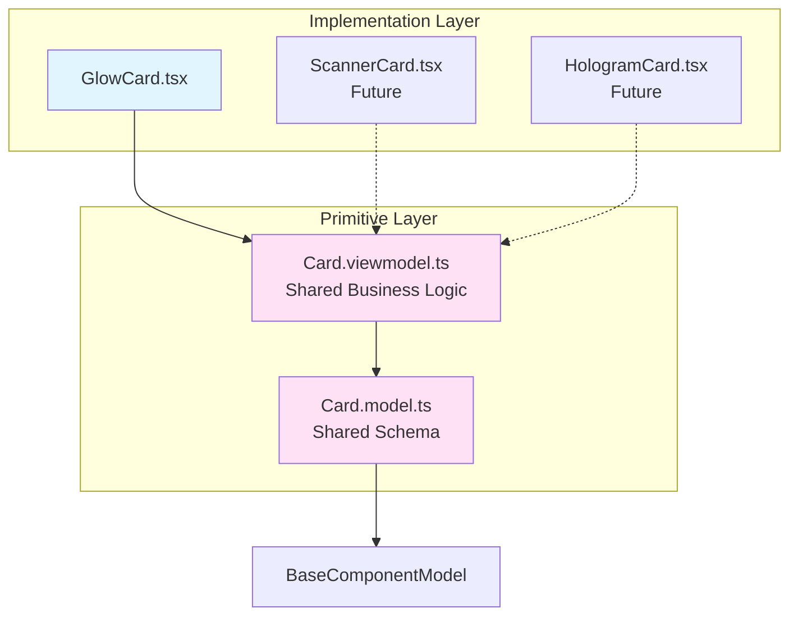

<p align="center">
  
</p>

<h1 align="center">Ark.Alliance.React.Component.UI</h1>
<h2 align="center">Cards Module</h2>

<p align="center">
  <strong>Flexible card components with primitive model/viewmodel sharing pattern.</strong>
</p>

---

**Author:** Armand Richelet-Kleinberg with the assistance of Anthropic Claude Opus 4.5

---

## Overview

The Cards module provides a collection of card components built on shared primitives (`Card.model.ts` + `Card.viewmodel.ts`). This architecture ensures consistency across card variants while enabling visual diversity.

## Components

### [GlowCard](./GlowCard/README.md)
Premium card with status-based glow effects.

**Key Features**:
- Status-based styling (idle, success, warning, error, info)
- Hover glow animation
- Optional header with icon and actions
- Compact mode
- Clickable with keyboard support

## Architecture: Primitive Pattern



### Primitive Components

#### Card.model.ts (PRIMITIVE)
Shared schema definition for all card variants.

**Exports**:
- `CardModelSchema` - Zod schema extending `BaseModelSchema`
- `CardStatus` - Status enum (idle, success, warning, error, info)
- `CARD_STATUS_CONFIG` - Color configuration for dark/light themes

**Key Properties**:
```typescript
{
  title: string;              // Required
  subtitle?: string;
  status: CardStatusType;     // Border/glow color
  variant: CardVariantType;   // Visual style
  compact: boolean;           // Reduced padding
  showHeader: boolean;
  glowColor?: string;         // Custom override
  borderColor?: string;       // Custom override
}
```

#### Card.viewmodel.ts (PRIMITIVE)
Shared business logic via `useCard` hook.

**Provides**:
- Click handling with event emission
- Hover state management
- Computed CSS classes and styles
- Status-based color resolution (dark/light)

**Returns**:
```typescript
{
  handleClick: () => void;
  isHovered: boolean;
  setIsHovered: (val: boolean) => void;
  cardClasses: string;
  cardStyles: CSSProperties;
  borderColor: string;
  glowColor: string;
}
```

---

## Usage

```typescript
import { GlowCard } from '@/components/Cards';

// Basic card
<GlowCard title="System Status" status="success">
  All systems operational
</GlowCard>

// With actions
<GlowCard 
  title="Alerts"
  status="warning"
  icon={<AlertIcon />}
  headerActions={<Button size="sm">View</Button>}
>
  3 pending alerts
</GlowCard>
```

---

## Common Improvements

All card components share these architectural recommendations:

### 🔄 Enum Consolidation

**Current**: Local `CardStatus` enum  
**Recommended**: Use `SemanticStatusSchema` from `@core/enums`

```typescript
// Card.model.ts - BEFORE
export const CardStatus = z.enum(['idle', 'success', 'warning', 'error', 'info']);

// Card.model.ts - AFTER
import { SemanticStatusSchema } from '@core/enums';
status: SemanticStatusSchema.default('idle');
```

**Impact**: Aligns with existing `SemanticStatus` in core enums, reduces duplication.

---

### 🎨 Theme Integration

**Current**: Uses `isDark` prop manually  
**Recommended**: Integrate `useTheme()` hook in primitive viewmodel

```typescript
// Card.viewmodel.ts - ADD
import { useTheme } from '@core/theme';

export function useCard(options) {
  const { resolvedMode } = useTheme();
  const isDark = options.isDark ?? (resolvedMode === 'dark');
  // Auto-detect theme
}
```

---

### 💾 CookieHelper Integration

**Opportunity**: Persist card layout preferences

```typescript
// Persist preferred variant (glass, elevated, etc.)
const [preferredVariant] = usePersistentState('ark-card-variant', 'default');

// Persist compact mode preference
const [preferredCompact] = usePersistentState('ark-card-compact', false);
```

---

### 🏗️ Primitive Enhancements

**Strengthen shared pattern**:

1. **Add Variant Styles to ViewModel**
   - Currently variant prop exists but no computed styles
   - Add glassmorphism, elevation shadows for variants

2. **Create Additional Card Implementations**
   - ScannerCard (animated scanline effect)
   - HologramCard (futuristic grid overlay)
   - Elevated Card (material design elevation)

3. **Document Primitive Pattern**
   - Help developers understand reusable architecture
   - Encourage consistent new card creation

---

### ⚡ Additional Features

1. **Loading State**: Skeleton shimmer for cards
2. **Expandable**: Collapsible body with smooth animation
3. **Badge Support**: Corner notification badges
4. **Drag Handle**: Sortable card list support

---

## Benefits of Primitive Architecture

### For GlowCard
- ✅ Minimal implementation (just visual styling)
- ✅ Automatic status color management
- ✅ Consistent behavior across cards

### For Developers
- ✅ **DRY**: Write once, use many times
- ✅ **Maintainability**: Fix bugs in one place
- ✅ **Extensibility**: New cards easy to create
- ✅ **Consistency**: Shared API across all card

s

### For Users
- ✅ Consistent UX across card types
- ✅ Predictable keyboard/accessibility behavior
- ✅ Unified theming

---

## Copyright & License

<p align="center">
  <strong>M2H.IO © 2022 - 2026 • Ark.Alliance Ecosystem</strong><br/>
  <sub>Armand Richelet-Kleinberg</sub>
</p>

<p align="center">
  Part of the <strong>Ark.Alliance.React.Component.UI</strong> library<br/>
  Enterprise-grade React components for the Ark Alliance Ecosystem
</p>
