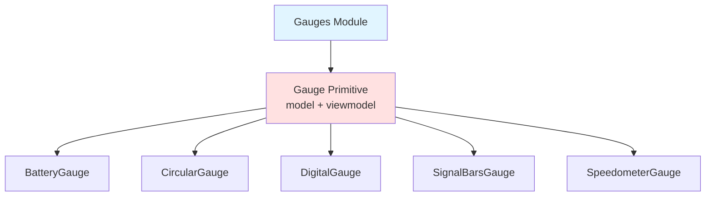

<p align="center">
  
</p>

<h1 align="center">Ark.Alliance.React.Component.UI</h1>
<h2 align="center">Gauges Module</h2>

<p align="center">
  <strong>Shared primitive for gauge components with auto-coloring and thresholds.</strong>
</p>

---

**Author:** Armand Richelet-Kleinberg with the assistance of Anthropic Claude Opus 4.5

---

## Overview

The Gauges module provides a shared primitive (`Gauge.model.ts`, `Gauge.viewmodel.ts`) for all gauge implementations with automatic color calculation based on thresholds.

## Features

- 🏗️ **Primitive Pattern** - Shared model/viewmodel ⭐
- 🎨 **Auto-Coloring** - Threshold-based color selection
- 📐 **3 Sizes** - sm, md, lg ⚠️ Custom enum
- 🎯 **Value Ranges** - Min/max with percentage display
- 🔔 **Thresholds** - Warning/danger levels
- 📊 **5 Gauge Types** - Battery, Circular, Digital, SignalBars, Speedometer

---

## Architecture - Primitive Pattern



### Primitive Components
- **Gauge.model.ts** - Shared schema (value, min, max, thresholds, color, size)
- **Gauge.viewmodel.ts** - Shared logic (auto-color calculation, percentage, formatting)

**Benefits**:
- DRY (Don't Repeat Yourself)
- Consistent API across all gauge types
- Easy to add new gauge variants

---

## Usage Example

### Using Shared Primitive

```typescript
import { useGauge } from '@/components/Gauges/Gauge.viewmodel';
import { CircularGauge } from '@/components/Gauges';

function MyGauge() {
  const vm = useGauge({
    value: 75,
    min: 0,
    max: 100,
    label: 'CPU Usage',
    autoColor: true,
    warningThreshold: 70,
    dangerThreshold: 90,
  });
  
  return <CircularGauge {...vm} />;
}
```

---

## Shared Properties (Gauge Primitive)

| Property | Type | Default | Description |
|----------|------|---------|-------------|
| `value` | `number` | `0` | Current value |
| `min` | `number` | `0` | Minimum value |
| `max` | `number` | `100` | Maximum value |
| `label` | `string` | required | Primary label |
| `unit` | `string` | - | Unit suffix (%, MB, ms) |
| `subLabel` | `string` | - | Secondary label |
| `color` | `GaugeColor` | `'blue'` | Color theme ⚠️ |
| `size` | `GaugeSize` | `'md'` | Size variant ⚠️ |
| `showPercentage` | `boolean` | `false` | Show % vs value |
| `decimals` | `number` | `0` | Decimal places (0-4) |
| `autoColor` | `boolean` | `false` | Auto-calculate color |
| `warningThreshold` | `number` | `75` | Warning threshold % |
| `dangerThreshold` | `number` | `90` | Danger threshold % |

### GaugeColor ⚠️ Custom Enum
`'blue' | 'green' | 'red' | 'cyan' | 'yellow' | 'purple'`

### GaugeSize ⚠️ Custom Enum
`'sm' | 'md' | 'lg'`

---

## Gauge Types

1. **BatteryGauge** - Battery charge indicator
2. **CircularGauge** - Radial progress gauge
3. **DigitalGauge** - LCD-style display
4. **SignalBarsGauge** - Signal strength bars
5. **SpeedometerGauge** - Speedometer arc

---

## Dependencies

### Core Modules
- `core/base`: extendSchema
- `core/constants`: GAUGE_COLORS

---

## Recommended Improvements

### ✅ Enum Consolidation - COMPLETE

**Status**: ✅ **FIXED - Using Core Enums!**

The Gauge primitive has been successfully refactored to use core enums:

```typescript
// Gauge.model.ts - NOW USING CORE ENUMS ✅
import { ThemeColorSchema, BasicSizeSchema } from '@core/enums';

color: ThemeColorSchema.default('cyan'),  // ✅ From core/enums
size: BasicSizeSchema.default('md'),       // ✅ From core/enums
```

**What Changed**:
- ✅ Removed custom `GaugeColor` enum
- ✅ Removed custom `GaugeSize` enum
- ✅ Now uses `ThemeColorSchema` (cyan, blue, purple, green, yellow, red)
- ✅ Now uses `BasicSizeSchema` (sm, md, lg)
- ✅ Default color: 'blue' → 'cyan' (matches ThemeColorSchema default)

**Impact**: Affects all 5 gauge types (Battery, Circular, Digital, SignalBars, Speedometer)

**Benefits**:
- Consistent colors and sizes across all components
- Single source of truth
- Better TypeScript autocomplete
- Easier to add new themes globally

---

### 🏗️ Excellent Primitive Pattern

**Current State**: ⭐ **Exemplary Architecture**

The Gauges module demonstrates excellent use of the primitive pattern:
- Shared model schema
- Shared viewModel with auto-color logic
- Consistent API across all implementations
- Easy extensibility

**Recommendation**: Document this pattern as a best practice for other component families (Buttons, Inputs).

---

<p align="center">
  <strong>M2H.IO © 2022 - 2026 • Ark.Alliance Ecosystem</strong>
</p>
