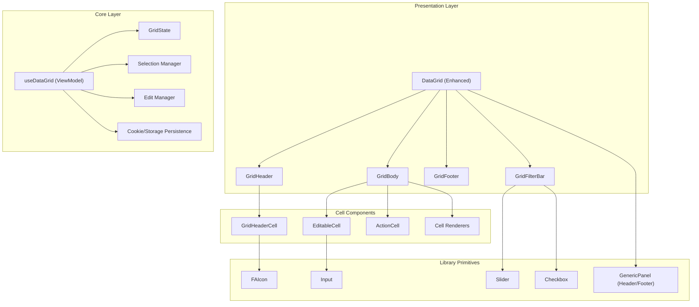

# DataGrid Component

Enterprise-grade data grid component with inline editing, virtual scrolling, column persistence, and advanced filtering.

## Architecture



## Folder Structure

```
DataGrid/
├── index.ts                    # Barrel export
├── DataGrid.tsx                # Main component view
├── DataGrid.model.ts           # Zod schemas and types
├── DataGrid.viewmodel.ts       # Main ViewModel hook
├── DataGrid.styles.css         # Main styles
│
├── state/                      # State management types
│   ├── index.ts
│   ├── FieldModel.ts           # Column/field definitions
│   ├── GridState.ts            # Sort, filter, query state
│   └── GridPrimitiveTypes.ts   # Base type definitions
│
├── HeaderCell/                 # Header cell component
│   ├── index.ts
│   ├── GridHeaderCell.tsx      # View
│   ├── GridHeaderCell.model.ts # Model
│   ├── GridHeaderCell.viewmodel.ts # ViewModel
│   └── GridHeaderCell.styles.css
│
├── Cell/                       # Cell components
│   ├── index.ts
│   ├── EditableCell.tsx        # Inline editing view
│   ├── EditableCell.model.ts   # Validation/format presets
│   ├── EditableCell.viewmodel.ts
│   ├── ActionCell.tsx          # Row actions view
│   ├── ActionCell.model.ts
│   ├── ActionCell.viewmodel.ts
│   └── Cell.styles.css
│
├── Header/                     # Grid header (future)
├── Body/                       # Grid body (future)
├── Footer/                     # Grid footer (future)
└── Filter/                     # Filter bar (future)
```

## MVVM Pattern

Each component follows the MVVM (Model-View-ViewModel) pattern:

| File | Purpose |
|------|---------|
| `*.model.ts` | Zod schemas, types, defaults, factory functions |
| `*.viewmodel.ts` | Business logic hook, state management, handlers |
| `*.tsx` | Pure view component, renders based on ViewModel |
| `*.styles.css` | Component-specific styles |

### Example: HeaderCell

```typescript
// Model (GridHeaderCell.model.ts)
export const GridHeaderCellModelSchema = z.object({
    fieldKey: z.string(),
    displayName: z.string(),
    sortable: z.boolean().default(true),
    // ...
});

// ViewModel (GridHeaderCell.viewmodel.ts)
export function useGridHeaderCell(options: UseGridHeaderCellOptions) {
    const [showFilter, setShowFilter] = useState(false);
    // Business logic...
    return { showFilter, handleSortClick, ... };
}

// View (GridHeaderCell.tsx)
export const GridHeaderCell = memo(function GridHeaderCell(props) {
    const vm = useGridHeaderCell(props);
    return <div onClick={vm.handleSortClick}>...</div>;
});
```

## Features

### Inline Editing

```tsx
<EditableCell
    model={{
        fieldKey: 'price',
        dataType: 'number',
        value: 123.45,
        validationPresets: ['required', 'positive'],
        formatPreset: 'currency',
    }}
    onCommit={(newValue) => updateRow('price', newValue)}
/>
```

#### Validation Presets

- `required` - Non-empty value
- `email` - Valid email format
- `url` - Valid URL format
- `number` - Numeric value
- `integer` - Whole number
- `positive` - Positive number
- `percentage` - 0-100 range
- `date` - Valid date
- `phone` - Phone number format

#### Format Presets

- `currency` - Currency formatting ($1,234.56)
- `percent` - Percentage (12.34%)
- `number` - Number with decimals
- `date` / `datetime` / `time` - Date formatting
- `boolean` - ✓ / ✗ display

### Row Actions

```tsx
<ActionCell
    row={orderData}
    actions={[
        { key: 'view', label: 'View', icon: 'eye', variant: 'view', onClick: handleView },
        { key: 'edit', label: 'Edit', icon: 'pen', variant: 'edit', onClick: handleEdit },
        { key: 'delete', label: 'Delete', icon: 'trash', variant: 'delete', 
          confirmMessage: 'Delete this item?', onClick: handleDelete },
    ]}
/>
```

### Column Persistence

Column widths, sort state, and page size are automatically persisted using cookies with localStorage fallback:

```tsx
import { useGridColumnWidths, useGridSortState, useGridPageSize } from '@/Helpers/Storage';

const [widths, setWidth] = useGridColumnWidths('orders-grid', defaultWidths);
const [sort, setSort] = useGridSortState('orders-grid');
const [pageSize, setPageSize] = useGridPageSize('orders-grid', 50);
```

### Header Cell Features

- **Sorting**: Click to cycle through asc → desc → none
- **Filtering**: Dropdown filter with text input
- **Resizing**: Drag border to resize columns

```tsx
<GridHeaderCell
    model={{
        fieldKey: 'symbol',
        displayName: 'Symbol',
        width: 100,
        sortable: true,
        filterable: true,
        resizable: true,
    }}
    onSort={handleSort}
    onFilter={handleFilter}
    onResize={handleResize}
/>
```

## Usage

```tsx
import { DataGrid } from '@/components/Grids/DataGrid';

const columns = [
    { fieldKey: 'id', displayName: 'ID', dataType: 'int', width: 60 },
    { fieldKey: 'symbol', displayName: 'Symbol', dataType: 'string', width: 100 },
    { fieldKey: 'price', displayName: 'Price', dataType: 'decimal', width: 120 },
    { fieldKey: 'actions', displayName: '', dataType: 'actions', width: 100 },
];

function OrdersGrid() {
    return (
        <DataGrid
            gridId="orders-grid"
            columns={columns}
            data={ordersData}
            enableEditing
            enablePersistence
            onRowEdit={handleRowEdit}
        />
    );
}
```

## Dependencies

- `zod` - Schema validation
- `FAIcon` - Icon component
- `CookieHelper` - Persistence utilities
- Base primitives (Slider, Input, Checkbox)
