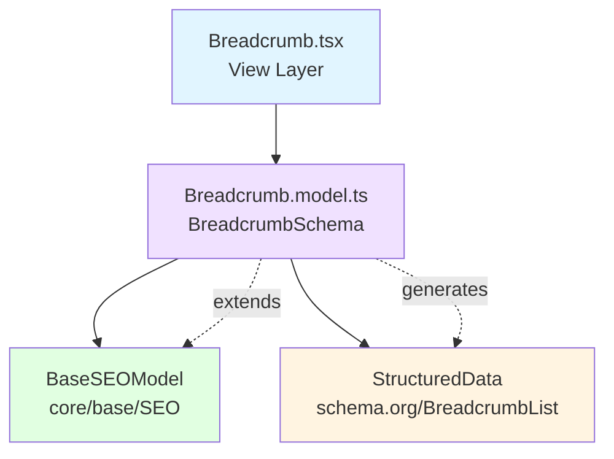

<p align="center">
  
</p>

<h1 align="center">Ark.Alliance.React.Component.UI</h1>
<h2 align="center">Breadcrumb Component</h2>

<p align="center">
  <strong>SEO-optimized breadcrumb navigation with schema.org structured data.</strong>
</p>

---

**Author:** Armand Richelet-Kleinberg with the assistance of Anthropic Claude Opus 4.5

---

## Overview

The Breadcrumb component provides navigation trail with automatic schema.org StructuredData generation for SEO. Extends `BaseSEOModel` for comprehensive metadata support.

## Features

- 🔍 **SEO Optimized** - Automatic schema.org BreadcrumbList
- 🧭 **Navigation** - Click-to-navigate trail
- 🎨 **Multiple Variants** - default, minimal, pills
- 📏 **3 Sizes** - sm, md, lg
- 🏠 **Home Icon** - Optional home indicator
- ✂️ **Custom Separators** - /, >, →, ·
- 🏗️ **SEO Extension** - Extends BaseSEOModel ✅

---

## Architecture



### SEO Integration
✅ **Extends**: `BaseSEOModel` via `extendSEOSchema()`  
✅ **Structured Data**: Automatic schema.org BreadcrumbList generation
⚠️ **Custom Enums**: Has custom `size` + `variant` enums (should use core)

---

## Usage Examples

### Basic Breadcrumb

```typescript
import { Breadcrumb } from '@/components/SEO';

const items = [
  { key: 'home', label: 'Home', href: '/', position: 1 },
  { key: 'products', label: 'Products', href: '/products', position: 2 },
  { key: 'laptops', label: 'Laptops', current: true, position: 3 },
];

<Breadcrumb items={items} />
```

### With Custom Separator

```typescript
<Breadcrumb
  items={items}
  separator="→"
  showHomeIcon
  variant="pills"
  size="lg"
/>
```

### SEO Enabled

```typescript
<Breadcrumb
  items={items}
  generateStructuredData
  siteName="My Store"
  siteUrl="https://example.com"
/>
```

---

## Properties

| Property | Type | Default | Description |
|----------|------|---------|-------------|
| `items` | `BreadcrumbItemModel[]` | required | Breadcrumb items |
| `separator` | `'/' \| '>' \| '→' \| '·'` | `'/'` | Separator character |
| `customSeparator` | `string` | - | Custom separator |
| `showHomeIcon` | `boolean` | `false` | Show home icon |
| `size` | `'sm' \| 'md' \| 'lg'` | `'md'` | Size variant ⚠️ |
| `variant` | `'default' \| 'minimal' \| 'pills'` | `'default'` | Visual variant ⚠️ |
| `generateStructuredData` | `boolean` | `true` | Generate schema.org |

### BreadcrumbItem Properties

| Property | Type | Description |
|----------|------|-------------|
| `key` | `string` | Unique identifier |
| `label` | `string` | Display text |
| `href` | `string` | URL (optional for current)|
| `icon` | `string` | Optional icon |
| `current` | `boolean` | Is current page |
| `position` | `number` | Position in trail |

---

## Dependencies

### Core Modules
- `core/base/SEO`:
  - `extendSEOSchema` - SEO schema extension
  - `BaseSEOModel` - Base SEO properties

---

## Recommended Improvements

### ✅ Enum Consolidation - COMPLETE

**Status**: ✅ **FIXED - Using Core Enum!**

The Breadcrumb component has been successfully refactored:

```typescript
// Breadcrumb.model.ts - NOW USING CORE ENUM ✅
import { BasicSizeSchema } from '@core/enums';

size: BasicSizeSchema.default('md'),  // ✅ From core/enums
```

**What Changed**:
- ✅ Removed custom size enum `z.enum(['sm', 'md', 'lg'])`
- ✅ Now uses `BasicSizeSchema` from `@core/enums`
- ✅ Kept component-specific variant enum (breadcrumb-specific: 'minimal', 'pills')

**Note**: Variant enum is intentionally component-specific as 'minimal' and 'pills' are breadcrumb-specific styles not applicable globally.

**Benefits**:
- Consistent sizing with all other components
- Single source of truth for sizes
- Better TypeScript autocomplete

---

### ⭐ SEO Integration - Exemplary

**Current State**: **Best Practice Example**

Breadcrumb extends `BaseSEOModel` and automatically generates Schema.org BreadcrumbList JSON-LD:

```typescript
import { extendSEOSchema } from '@core/base/SEO';

export const BreadcrumbSchema = extendSEOSchema({
  items: z.array(BreadcrumbItemSchema),
  // Inherits: baseUrl, generateSchema, id, disabled, etc.
});
```

**Features**:
- Automatic Schema.org markup generation
- AI crawler compliance (GPTBot, ClaudeBot, PerplexityBot, Google-Extended)
- SEO/AEO optimization
- Position-based schema generation

**Recommendation**: Use as reference for other SEO-aware components.

---

### 🎨 Theme Integration

**Recommendation**: Add theme hook

```typescript
import { useTheme } from '@core/theme';

export function useBreadcrumb(options) {
  const { resolvedMode } = useTheme();
  // Auto-detect dark/light mode
}
```

---

<p align="center">
  <strong>M2H.IO © 2022 - 2026 • Ark.Alliance Ecosystem</strong>
</p>
