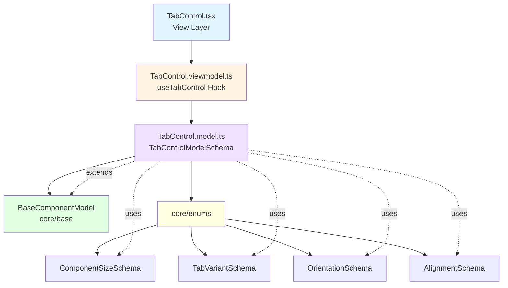

<p align="center">
  
</p>

<h1 align="center">Ark.Alliance.React.Component.UI</h1>
<h2 align="center">TabControl Component</h2>

<p align="center">
  <strong>Tabbed interface with multiple styles,orientations, and keyboard navigation.</strong>
</p>

---

**Author:** Armand Richelet-Kleinberg with the assistance of Anthropic Claude Opus 4.5

---

## Overview

The TabControl component provides a complete tabbed interface system with support for vertical/horizontal layouts, multiple visual variants, icons, badges, and full keyboard accessibility.

## Features

- ✨ **Multiple Variants** - default, pills, underline, bordered
- 📐 **Orientations** - horizontal, vertical
- 📍 **Alignments** - start, center, end
- 📏 **5 Sizes** - xs, sm, md, lg, xl
- 🎯 **Closeable Tabs** - Optional close buttons
- ⌨️ **Keyboard Navigation** - Arrow keys, Home, End
- 🔄 **Scrollable** - Auto-scroll overflow tabs
- 🎨 **Theme Aware** - Dark/light mode
- 🏗️ **Proper Enums** - Uses 4 core enums ⭐⭐⭐⭐

---

## Architecture



### Base Component Integration
✅ **Extends**: `BaseComponentModel` via `extendSchema()`  
✅ **ViewModel**: Uses `useBaseViewModel`  
✅ **Enums**: Uses 4 core enums ⭐⭐⭐⭐

**Core Enums Used**:
- `ComponentSizeSchema` (xs-xl)
- `TabVariantSchema` (default, pills, underline, bordered)
- `OrientationSchema` (horizontal, vertical)
- `AlignmentSchema` (start, center, end)

---

## Usage Examples

### Basic Tabs

```typescript
import { TabControl } from '@/components/TabControl';

const items = [
  { tabKey: 'home', label: 'Home', content: <HomePage /> },
  { tabKey: 'profile', label: 'Profile', content: <ProfilePage /> },
  { tabKey: 'settings', label: 'Settings', content: <SettingsPage /> },
];

<TabControl items={items} defaultActiveKey="home" />
```

### Vertical Pills with Icons

```typescript
<TabControl
  items={[
    { tabKey: 'dashboard', label: 'Dashboard', icon: '📊' },
    { tabKey: 'analytics', label: 'Analytics', icon: '📈' },
    { tabKey: 'reports', label: 'Reports', icon: '📄', badge: 5 },
  ]}
  variant="pills"
  orientation="vertical"
  size="lg"
/>
```

### Closeable Tabs

```typescript
<TabControl
  items={tabs}
  closeable
  onClose={(tabKey) => removeTab(tabKey)}
  variant="bordered"
  scrollable
/>
```

---

## Properties

| Property | Type | Default | Description |
|----------|------|---------|-------------|
| `items` | `TabItemModel[]` | `[]` | Array of tab items |
| `activeKey` | `string` | - | Controlled active tab key |
| `defaultActiveKey` | `string` | - | Uncontrolled default active |
| `variant` | `TabVariant` | `'default'` | Visual variant |
| `orientation` | `Orientation` | `'horizontal'` | Layout orientation |
| `alignment` | `Alignment` | `'start'` | Tab alignment |
| `size` | `ComponentSize` | `'md'` | Size variant |
| `fill` | `boolean` | `false` | Fill available width/height |
| `scrollable` | `boolean` | `false` | Enable scrolling overflow |
| `closeable` | `boolean` | `false` | Show close buttons |
| `iconsOnly` | `boolean` | `false` | Show only icons |
| `gap` | `number` | `4` | Gap between tabs (px) |
| `animationDuration` | `number` | `200` | Animation duration (ms) |
| `onChange` | `(key: string) => void` | - | Active tab change handler |
| `onClose` | `(key: string) => void` | - | Tab close handler |

### TabItem Properties

| Property | Type | Description |
|----------|------|-------------|
| `tabKey` | `string` | Unique identifier |
| `label` | `string` | Tab label text |
| `icon` | `ReactNode` | Optional icon |
| `badge` | `number` | Optional badge count |
| `disabled` | `boolean` | Disable tab |
| `content` | `ReactNode` | Tab panel content |

---

## Dependencies

### Core Modules
- `core/base`: extendSchema, useBaseViewModel
- `core/enums`: ⭐⭐⭐⭐
  - `ComponentSizeSchema`
  - `TabVariantSchema`
  - `OrientationSchema`
  - `AlignmentSchema`

---

## Recommended Improvements

### ✅ Enum Usage - EXEMPLARY

**Current State**: ⭐⭐⭐⭐ **Perfect - Uses 4 Core Enums!**

```typescript
// TabControl.model.ts - ALREADY USING CORE ENUMS ✅
import {
    ComponentSizeSchema,
    TabVariantSchema,
    OrientationSchema,
    AlignmentSchema,
} from '@core/enums';
```

**Result**: TabControl is a model example of proper architecture!

---

### 🎨 Theme Integration

**Recommendation**: Add theme hook

```typescript
// TabControl.viewmodel.ts - ADD
import { useTheme } from '@core/theme';

export function useTabControl(options) {
  const { resolvedMode } = useTheme();
  const isDark = options.isDark ?? (resolvedMode === 'dark');
}
```

---

### 💾 CookieHelper Integration

**Opportunity**: Persist active tab

```typescript
// Remember last active tab per view
const [activeTab, setActiveTab] = usePersistentState(
  `ark-tabs-${viewId}`,
  defaultActiveKey
);
```

---

<p align="center">
  <strong>M2H.IO © 2022 - 2026 • Ark.Alliance Ecosystem</strong>
</p>
