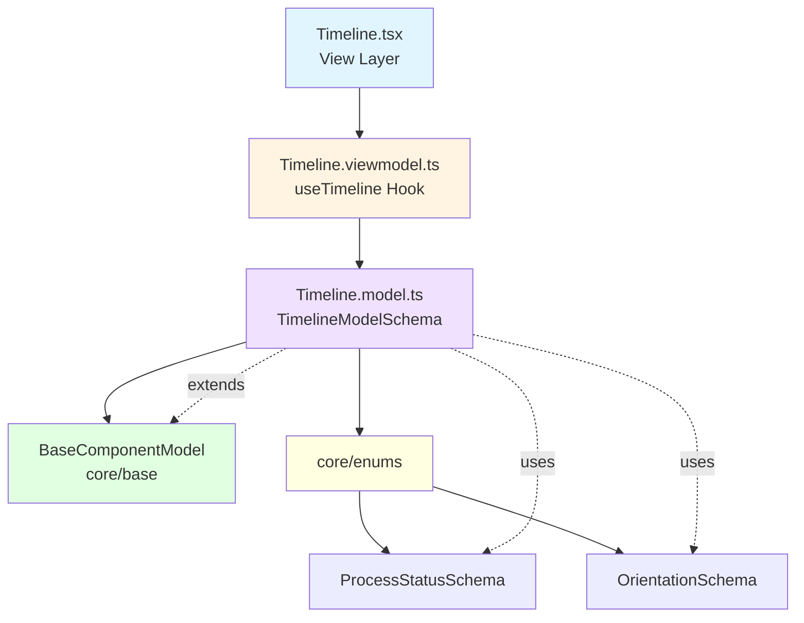

<p align="center">
  
</p>

<h1 align="center">Ark.Alliance.React.Component.UI</h1>
<h2 align="center">Timeline Component</h2>

<p align="center">
  <strong>Chronological event display with filtering and status tracking.</strong>
</p>

---

**Author:** Armand Richelet-Kleinberg with the assistance of Anthropic Claude Opus 4.5

---

## Overview

The Timeline component displays chronological events with support for filtering, categorization, status indicators, and both vertical and horizontal layouts.

## Features

- ✨ **Process Status** - pending, in-progress, completed, failed (using ProcessStatusSchema)
- 📐 **Orientations** - vertical, horizontal
- 🔍 **Filtering** - By text, category, tags
- 🎬 **Animations** - Smooth entry animations
- 📊 **Admin Mode** - Edit/manage timeline items
- 🎨 **Theme Aware** - Auto styling
- 🏗️ **Proper Enums** - Uses ProcessStatusSchema, OrientationSchema ⭐⭐

---

## Architecture



### Base Component Integration
✅ **Extends**: `BaseComponentModel` via `extendSchema()`  
✅ **ViewModel**: Uses `useBaseViewModel`  
✅ **Enums**: Uses `ProcessStatusSchema`, `OrientationSchema` ⭐⭐

---

## Usage Examples

### Basic Timeline

```typescript
import { Timeline } from '@/components/TimeLines';

const events = [
  {
    id: '1',
    title: 'Project Started',
    description: 'Initial planning phase',
    date: '2024-01-01',
    status: 'completed',
  },
  {
    id: '2',
    title: 'Development',
    description: 'Building features',
    date: '2024-01-15',
    status: 'in-progress',
  },
];

<Timeline items={events} />
```

### Horizontal with Categories

```typescript
<Timeline
  items={events}
  orientation="horizontal"
  showConnectors
  selectedCategory="Development"
  animateNewItems
/>
```

---

## Properties

| Property | Type | Default | Description |
|----------|------|---------|-------------|
| `items` | `TimelineItem[]` | `[]` | Timeline events |
| `orientation` | `Orientation` | `'vertical'` | Layout orientation |
| `showConnectors` | `boolean` | `true` | Show connector lines |
| `maxItems` | `number` | `0` | Max items (0=unlimited) |
| `autoScroll` | `boolean` | `true` | Auto-scroll to new items |
| `animateNewItems` | `boolean` | `true` | Animate new entries |
| `adminMode` | `boolean` | `false` | Enable edit mode |
| `filter` | `string` | - | Text filter query |
| `selectedCategory` | `string` | - | Category filter |
| `dateFormat` | `string` | - | Custom date format |

### TimelineItem Properties

| Property | Type | Description |
|----------|------|-------------|
| `id` | `string` | Unique identifier |
| `title` | `string` | Event title |
| `description` | `string` | Event description |
| `date` | `string` | Event date |
| `icon` | `string` | Optional icon |
| `status` | `ProcessStatus` | Event status |
| `category` | `string` | Event category |
| `tags` | `string[]` | Search tags |

---

## Dependencies

### Core Modules
- `core/base`: extendSchema, useBaseViewModel
- `core/enums`: ⭐⭐
  - `ProcessStatusSchema` (pending, in-progress, completed, failed)
  - `OrientationSchema` (vertical, horizontal)

---

## Recommended Improvements

### ✅ Enum Usage - EXEMPLARY

**Current State**: ⭐⭐ **Perfect - Uses Core Enums!**

```typescript
// Timeline.model.ts - ALREADY USING CORE ENUMS ✅
import { ProcessStatusSchema, OrientationSchema } from '@core/enums';
```

---

### 💾 CookieHelper Integration

**Opportunity**: Persist filters

```typescript
// Remember filter/category preferences
const [filter, setFilter] = usePersistentState('ark-timeline-filter', '');
const [category, setCategory] = usePersistentState('ark-timeline-category', '');
```

---

<p align="center">
  <strong>M2H.IO © 2022 - 2026 • Ark.Alliance Ecosystem</strong>
</p>
