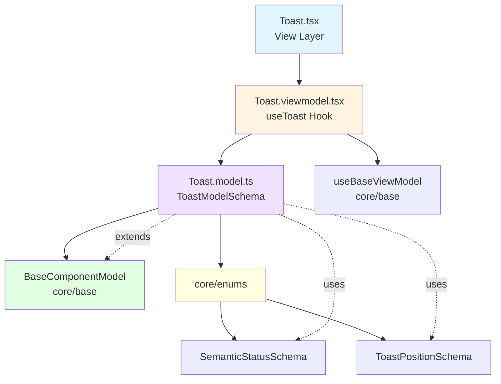

<p align="center">
  
</p>

<h1 align="center">Ark.Alliance.React.Component.UI</h1>
<h2 align="center">Toast Component</h2>

<p align="center">
  <strong>Notification system with positioning, stacking, and auto-dismiss capabilities.</strong>
</p>

---

**Author:** Armand Richelet-Kleinberg with the assistance of Anthropic Claude Opus 4.5

---

## Overview

The Toast component provides a complete notification system with customizable positioning, auto-dismiss timers, action buttons, and accessibility features. Built following MVVM pattern with proper enum usage from core.

## Features

- ✨ **Multiple Types** - success, error, warning, info (using SemanticStatus)
- 📍 **9 Positions** - All corners, edges, and center (using ToastPosition enum)
- 📚 **Stacking** - Multiple toasts with configurable stacking behavior
- ⏱️ **Auto-Dismiss** - Configurable duration with pause on hover
- 🎬 **Animations** - Smooth enter/exit transitions
- 🎯 **Actions** - Optional action buttons with callbacks
- ♿ **Accessible** - ARIA live regions, keyboard dismissal
- 🎨 **Theme Aware** - Dark/light mode support
- 🏗️ **Proper Enums** - Uses SemanticStatusSchema, ToastPositionSchema

---

## Architecture



### MVVM Pattern
- **Model** (`Toast.model.ts`): Zod schema, uses core enums ✅
- **ViewModel** (`Toast.viewmodel.tsx`): State management, toast queue, timers
- **View** (`Toast.tsx`): Presentational component with animations

### Base Component Integration
✅ **Extends**: `BaseComponentModel` via `extendSchema()`  
✅ **ViewModel**: Uses `useBaseViewModel`  
✅ **Enums**: Uses `SemanticStatusSchema` and `ToastPositionSchema` from `@core/enums` ⭐

---

## Usage Examples

### Basic Toast

```typescript
import { Toast, useToast } from '@/components/Toast';

function MyComponent() {
  const { showToast } = useToast();
  
  return (
    <>
      <button onClick={() => showToast({
        message: 'Successfully saved!',
        type: 'success'
      })}>
        Show Toast
      </button>
      
      <Toast position="top-right" />
    </>
  );
}
```

### With Title and Action

```typescript
showToast({
  title: 'Update Available',
  message: 'A new version is available.',
  type: 'info',
  duration: 0, // Manual dismiss only
  action: {
    label: 'Update Now',
    onClick: () => handleUpdate()
  }
});
```

### All Toast Types

```typescript
// Success
showToast({ message: 'Operation completed', type: 'success' });

// Error
showToast({ message: 'Something went wrong', type: 'error' });

// Warning
showToast({ message: 'Please review', type: 'warning' });

// Info
showToast({ message: 'New notification', type: 'info' });
```

### Custom Position

```typescript
<Toast 
  position="bottom-center"
  maxToasts={3}
  pauseOnHover
  pauseOnFocusLoss
/>
```

---

## Properties

### Toast (Container) Props

| Property | Type | Default | Description |
|----------|------|---------|-------------|
| `position` | `ToastPositionType` | `'top-right'` | Toast container position |
| `maxToasts` | `number` | `5` | Maximum toasts to display |
| `stacked` | `boolean` | `true` | Stack toasts vs replace |
| `gap` | `number` | `12` | Gap between toasts (px) |
| `animationDuration` | `number` | `300` | Animation duration (ms) |
| `pauseOnHover` | `boolean` | `true` | Pause timer on hover |
| `pauseOnFocusLoss` | `boolean` | `true` | Pause timer when window blurred |

### ToastItem Schema

| Property | Type | Required | Description |
|----------|------|----------|-------------|
| `id` | `string` | auto | Unique identifier |
| `message` | `string` | ✅ | Toast message content |
| `type` | `ToastTypeValue` | `'info'` | Toast severity/type |
| `title` | `string` | ❌ | Optional title |
| `duration` | `number` | `4000` | Auto-dismiss duration (ms, 0=manual) |
| `icon` | `string` | auto | Icon name (auto-set by type) |
| `dismissible` | `boolean` | `true` | Show close button |
| `action` | `ToastAction` | ❌ | Optional action button |
| `createdAt` | `number` | auto | Timestamp |

### ToastPositionType (from core/enums)
`'top-left' | 'top-center' | 'top-right' | 'bottom-left' | 'bottom-center' | 'bottom-right' | 'center-left' | 'center' | 'center-right'`

### ToastTypeValue (SemanticStatus)
`'success' | 'error' | 'warning' | 'info' | 'neutral'`

---

## Methods (Hook API)

The `useToast` hook provides:

| Method | Parameters | Returns | Description |
|--------|------------|---------|-------------|
| `showToast` | `(data: Partial<ToastItem>)` | `string` | Show toast, returns ID |
| `dismissToast` | `(id: string)` | `void` | Dismiss specific toast |
| `clear All` | `()` | `void` | Dismiss all toasts |
| `toasts` | - | `ToastItem[]` | Current toast queue |

---

## Dependencies

### Core Modules
- `core/base`:
  - `extendSchema` - Schema extension utility
  - `useBaseViewModel` - Base ViewModel hook
- `core/enums`:⭐
  - `SemanticStatusSchema` - Toast type enum
  - `ToastPositionSchema` - Position enum

### External Libraries
- `zod` - Schema validation
- `react` - Component framework, hooks

---

## Theming

Toast uses CSS variables and TOAST_TYPE_COLORS configuration:

```scss
.ark-toast {
  --ark-success: #22c55e;
  --ark-error: #ef4444;
  --ark-warning: #eab308;
  --ark-info: #3b82f6;
}
```

### Type Colors (from model)
```typescript
const TOAST_TYPE_COLORS = {
  success: 'var(--ark-success)',
  error: 'var(--ark-error)',
  warning: 'var(--ark-warning)',
  info: 'var(--ark-info)',
};
```

---

## Accessibility Features

### ARIA Support
- `role="status"` or `role="alert"` on toast items
- `aria-live="polite"` or `"assertive"` for screen readers
- `aria-atomic="true"` for complete announcements

### Keyboard Support
- **Escape**: Dismiss focused toast
- **Tab**: Navigate through action buttons

### Focus Management
- Auto-focus on action button when toast appears (if has action)
- Return focus on dismiss

---

## Browser Support

- ✅ Chrome/Edge 90+
- ✅ Firefox 88+
- ✅ Safari 14+
- ✅ iOS Safari 14+
- ✅ Android Chrome 90+

---

## Performance Considerations

1. **Queue Management**: Limits to `maxToasts`, auto-removes oldest
2. **Timer Cleanup**: Proper cleanup on unmount, pause/resume
3. **Animation**: CSS transitions (GPU accelerated)
4. **Memoization**: Toast items memoized to prevent re-renders

---

## Testing

```typescript
import { render, screen, fireEvent, waitFor } from '@testing-library/react';
import { Toast, showToast } from './Toast';

test('displays toast message', () => {
  render(<Toast />);
  showToast({ message: 'Test message', type: 'success' });
  
  expect(screen.getByText('Test message')).toBeInTheDocument();
});

test('auto-dismisses after duration', async () => {
  render(<Toast />);
  showToast({ message: 'Auto dismiss', duration: 1000 });
  
  await waitFor(() => {
    expect(screen.queryByText('Auto dismiss')).not.toBeInTheDocument();
  }, { timeout: 1500 });
});

test('pauses on hover', () => {
  render(<Toast pauseOnHover />);
  showToast({ message: 'Hover me', duration: 1000 });
  
  const toast = screen.getByText('Hover me').closest('.ark-toast');
  fireEvent.mouseEnter(toast!);
  
  // Timer should pause
});
```

---

## Recommended Improvements

### ✅ Enum Usage - ALREADY EXCELLENT

**Current State**: ⭐ **Perfect Implementation**

```typescript
// Toast.model.ts - ALREADY USING CORE ENUMS ✅
import { SemanticStatusSchema, ToastPositionSchema } from '@core/enums';

export const ToastType = SemanticStatusSchema;
export const ToastPosition = ToastPositionSchema;
```

**Result**: Toast component is a model example of proper enum usage!

---

### 🎨 Theme Integration

**Current State**: ❌ Does not use `useTheme()` hook

**Recommendation**: Auto-detect theme mode

```typescript
// Toast.viewmodel.tsx - ADD
import { useTheme } from '@core/theme';

export function useToast(options) {
  const { resolvedMode } = useTheme();
  // Apply dark/light mode classes to toasts
  const themeClass = resolvedMode === 'dark' ? 'ark-toast--dark' : 'ark-toast--light';
}
```

---

### 💾 CookieHelper Integration

**Opportunity**: Persist toast preferences

**Recommended Implementation**:

```typescript
// Persist user's preferred toast position
const [preferredPosition] = usePersistentState(
  'ark-toast-position',
  'top-right'
);

// Persist duration preference
const [preferredDuration] = usePersistentState(
  'ark-toast-duration',
  4000
);

// Remember dismissed toasts (don't re-show)
const [dismissedToasts, setDismissedToasts] = usePersistentState<string[]>(
  'ark-toast-dismissed',
  []
);
```

**Use Cases**:
- Remember user's preferred notification position
- Save custom duration preferences
- Track dismissed important notifications (e.g., changelog, announcements)

---

### 🔍 SEO Support

**Current State**: Not applicable - UI interaction component

---

### ⚡ Additional Enhancements

1. **Sound Support**: Optional notification sounds
2. **Progress Bar**: Visual timer indicator
3. **Grouped Toasts**: Combine similar toasts ("3 new messages")
4. **Rich Content**: Support for React components in message body
5. **Swipe to Dismiss**: Touch gesture support
6. **Persistent Toasts**: Optional localStorage queue for important notifications

---

### 🏗️ Architecture Praise

**Toast is exemplary in**:
- ✅ Uses `SemanticStatusSchema` from core/enums
- ✅ Uses `ToastPositionSchema` from core/enums
- ✅ Extends `BaseComponentModel` properly
- ✅ Follows MVVM pattern consistently
- ✅ Comprehensive type safety with Zod

**Model for other components to follow!**

---

## Copyright & License

<p align="center">
  <strong>M2H.IO © 2022 - 2026 • Ark.Alliance Ecosystem</strong><br/>
  <sub>Armand Richelet-Kleinberg</sub>
</p>

<p align="center">
  Part of the <strong>Ark.Alliance.React.Component.UI</strong> library<br/>
  Enterprise-grade React components for the Ark Alliance Ecosystem
</p>
