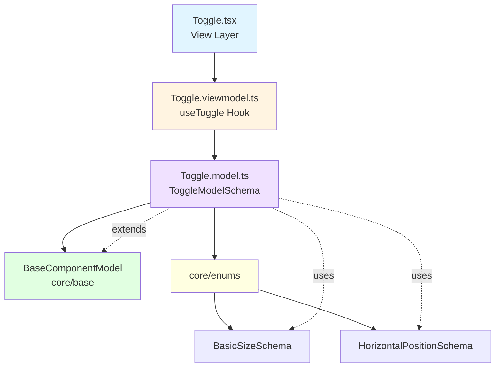

<p align="center">
  
</p>

<h1 align="center">Ark.Alliance.React.Component.UI</h1>
<h2 align="center">Toggle Component</h2>

<p align="center">
  <strong>Switch control with customizable colors and labels.</strong>
</p>

---

**Author:** Armand Richelet-Kleinberg with the assistance of Anthropic Claude Opus 4.5

---

## Overview

The Toggle component provides an accessible switch/toggle control with customizable colors, sizes, and labels. Built following MVVM pattern with proper enum usage.

## Features

- ✨ **Customizable Colors** - ON/OFF colors, background
- 📐 **3 Sizes** - sm, md, lg (using BasicSizeSchema)
- 🏷️ **Flexible Labels** - Optional label, ON/OFF state labels
- 📍 **Label Positioning** - Left or right (using HorizontalPositionSchema)
- ♿ **Accessible** - ARIA roles, keyboard support
- 🎨 **Theme Aware** - Automatic styling
- 🏗️ **Proper Enums** - Uses BasicSizeSchema + HorizontalPositionSchema ⭐

---

## Architecture



### MVVM Pattern
- **Model** (`Toggle.model.ts`): Zod schema, uses `BasicSizeSchema` + `HorizontalPositionSchema` ✅
- **ViewModel** (`Toggle.viewmodel.ts`): State management, change handling  
- **View** (`Toggle.tsx`): Presentational component

### Base Component Integration
✅ **Extends**: `BaseComponentModel` via `extendSchema()`  
✅ **ViewModel**: Uses `useBaseViewModel`  
✅ **Enums**: Uses `BasicSizeSchema` and `HorizontalPositionSchema` from `@core/enums` ⭐

---

## Usage Examples

### Basic Usage

```typescript
import { Toggle } from '@/components/Toggles';

const [enabled, setEnabled] = useState(false);

<Toggle 
  checked={enabled}
  onChange={setEnabled}
  label="Enable notifications"
/>
```

### With State Labels

```typescript
<Toggle 
  checked={isActive}
  onChange={setIsActive}
  onLabel="ACTIVE"
  offLabel="INACTIVE"
/>
```

### Custom Colors & Size

```typescript
<Toggle
  checked={isDarkMode}
  onChange={setIsDarkMode}
  size="lg"
  onColor="#10b981"
  offColor="#ef4444"
  label="Dark Mode"
  labelPosition="left"
/>
```

---

## Properties

| Property | Type | Default | Description |
|----------|------|---------|-------------|
| `checked` | `boolean` | `false` | Current checked state |
| `onChange` | `(checked: boolean) => void` | - | Change handler |
| `size` | `BasicSize` | `'md'` | Toggle size |
| `label` | `string` | - | Optional label text |
| `labelPosition` | `HorizontalPosition` | `'right'` | Label position |
| `onLabel` | `string` | - | Label when ON |
| `offLabel` | `string` | - | Label when OFF |
| `onColor` | `string` | `'#10b981'` | Color when ON |
| `offColor` | `string` | `'#4b5563'` | Color when OFF |
| `backgroundColor` | `string` | auto | Track background |
| `disabled` | `boolean` | `false` | Disable interaction |

### BasicSize (from core/enums)
`'sm' | 'md' | 'lg'`

### HorizontalPosition (from core/enums)
`'left' | 'right'`

---

## Dependencies

### Core Modules
- `core/base`:
  - `extendSchema`
  - `useBaseViewModel`
- `core/enums`: ⭐
  - `BasicSizeSchema` - Size enum
  - `HorizontalPositionSchema` - Label position

### External Libraries
- `zod`
- `react`

---

## Recommended Improvements

### ✅ Enum Usage - EXEMPLARY

**Current State**: ⭐ **Perfect Implementation**

```typescript
// Toggle.model.ts - ALREADY USING CORE ENUMS ✅
import { BasicSizeSchema, HorizontalPositionSchema } from '@core/enums';

export const ToggleModelSchema = extendSchema({
  size: BasicSizeSchema.default('md'),
  labelPosition: HorizontalPositionSchema.default('right'),
});
```

---

### 💾 CookieHelper Integration

**Opportunity**: Persist toggle states

```typescript
// Persist toggle states across sessions
const [isDarkMode, setIsDarkMode] = usePersistentState('app-dark-mode', false);
const [notifications, setNotifications] = usePersistentState('app-notifications', true);

<Toggle checked={isDarkMode} onChange={setIsDarkMode} label="Dark Mode" />
<Toggle checked={notifications} onChange={setNotifications} label="Notifications" />
```

---

## Copyright & License

<p align="center">
  <strong>M2H.IO © 2022 - 2026 • Ark.Alliance Ecosystem</strong><br/>
  <sub>Armand Richelet<-Kleinberg</sub>
</p>
