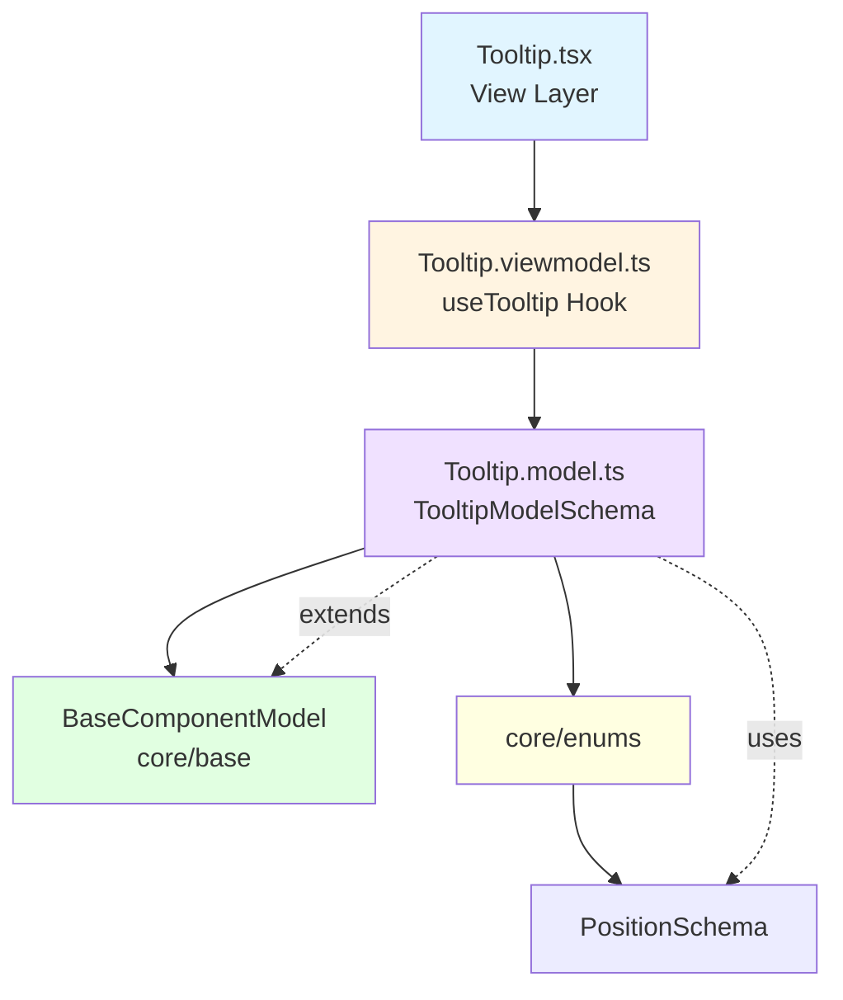

<p align="center">
  
</p>

<h1 align="center">Ark.Alliance.React.Component.UI</h1>
<h2 align="center">Tooltip Component</h2>

<p align="center">
  <strong>Contextual information overlay with smart positioning.</strong>
</p>

---

**Author:** Armand Richelet-Kleinberg with the assistance of Anthropic Claude Opus 4.5

---

## Overview

The Tooltip component provides contextual information that appears on hover or focus. Built with accessibility in mind, it intelligently positions itself relative to the trigger element.

## Features

- ✨ **Smart Positioning** - Auto-adjusts using PositionSchema (top, bottom, left, right)
- ⏱️ **Configurable Delay** - Customizable show delay
- 🎯 **Flexible Content** - String or React elements
- ♿ **Accessible** - ARIA roles, keyboard support
- 🎨 **Theme Aware** - Automatic dark/light mode
- 🏗️ **Proper Enums** - Uses PositionSchema from core/enums ⭐

---

## Architecture



### MVVM Pattern
- **Model** (`Tooltip.model.ts`): Zod schema, uses core `PositionSchema` ✅
- **ViewModel** (`Tooltip.viewmodel.ts`): Position calculation, delay management
- **View** (`Tooltip.tsx`): Presentational component

### Base Component Integration
✅ **Extends**: `BaseComponentModel` via `extendSchema()`  
✅ **ViewModel**: Uses `useBaseViewModel`  
✅ **Enums**: Uses `PositionSchema` from `@core/enums` ⭐

---

## Usage Examples

### Basic Usage

```typescript
import { Tooltip } from '@/components/Tooltip';

<Tooltip content="Helpful tooltip text">
  <button>Hover me</button>
</Tooltip>
```

### Different Positions

```typescript
<Tooltip content="Top tooltip" position="top">
  <span>Top</span>
</Tooltip>

<Tooltip content="Right tooltip" position="right">
  <span>Right</span>
</Tooltip>
```

### Custom Delay

```typescript
<Tooltip 
  content="Shows after 500ms"
  delay={500}
>
  <button>Slow tooltip</button>
</Tooltip>
```

### Rich Content

```typescript
<Tooltip 
  content={
    <div>
      <strong>Title</strong>
      <p>Description with formatting</p>
    </div>
  }
>
  <button>Rich content</button>
</Tooltip>
```

---

## Properties

| Property | Type | Default | Description |
|----------|------|---------|-------------|
| `content` | `string \| ReactNode` | - | Tooltip content |
| `position` | `Position` | `'top'` | Position relative to trigger |
| `delay` | `number` | `300` | Delay in ms before showing |
| `isVisible` | `boolean` | `false` | Controlled visibility |
| `children` | `ReactNode` | required | Trigger element |
| `className` | `string` | `''` | Additional CSS classes |

### Position Type (from core/enums)
`'top' | 'bottom' | 'left' | 'right' | 'top-left' | 'top-right' | 'bottom-left' | 'bottom-right'`

---

## Dependencies

### Core Modules
- `core/base`:
  - `extendSchema` - Schema extension utility
  - `useBaseViewModel` - Base ViewModel hook
- `core/enums`: ⭐
  - `PositionSchema` - Position enum

### External Libraries
- `zod` - Schema validation
- `react` - Component framework

---

## Recommended Improvements

### ✅ Enum Usage - EXEMPLARY

**Current State**: ⭐ **Perfect Implementation**

```typescript
// Tooltip.model.ts - ALREADY USING CORE ENUMS ✅
import { PositionSchema } from '@core/enums';

export const TooltipModelSchema = extendSchema({
  position: PositionSchema.default('top'),
});
```

**Result**: Tooltip is a model example!

---

### 🎨 Theme Integration

**Recommendation**: Add explicit theme mode detection

```typescript
// Tooltip.viewmodel.ts - ADD
import { useTheme } from '@core/theme';

export function useTooltip(options) {
  const { resolvedMode } = useTheme();
  // Apply theme-specific styles
}
```

---

### 💾 CookieHelper Integration

**Opportunity**: Remember tooltip preferences

```typescript
// Persist user's preferred tooltip delay
const [preferredDelay] = usePersistentState('ark-tooltip-delay', 300);

// Track dismissed tooltips (for onboarding/tutorials)
const [dismissedTooltips, setDismissedTooltips] = usePersistentState<string[]>(
  'ark-tooltips-dismissed',
  []
);
```

---

## Copyright & License

<p align="center">
  <strong>M2H.IO © 2022 - 2026 • Ark.Alliance Ecosystem</strong><br/>
  <sub>Armand Richelet-Kleinberg</sub>
</p>
