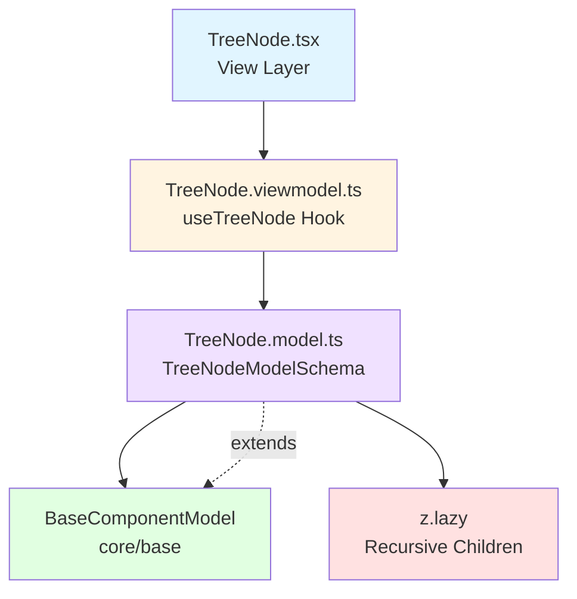

<p align="center">
  
</p>

<h1 align="center">Ark.Alliance.React.Component.UI</h1>
<h2 align="center">TreeNode Component</h2>

<p align="center">
  <strong>Recursive tree node with expand/collapse and selection.</strong>
</p>

---

**Author:** Armand Richelet-Kleinberg with the assistance of Anthropic Claude Opus 4.5

---

## Overview

The TreeNode component provides individual nodes for tree structures with support for recursive children, icons, badges, expand/collapse, and selection states.

## Features

- 🌳 **Recursive Structure** - Infinite nesting support
- 📁 **Expand/Collapse** - Collapsible branches
- ✅ **Selectable** - Click to select nodes
- 🎨 **Icons** - Custom expand/collapse icons
- 🔢 **Badges** - Notification counts
- 📊 **Metadata** - Arbitrary data storage
- 🏗️ **BaseComponentModel** - Extends base for interactions ✅

---

## Architecture



### Base Component Integration
✅ **Extends**: `BaseComponentModel` via `extendSchema()`  
✅ **Recursive Schema**: Uses `z.lazy()` for infinite nesting
✅ **Metadata Support**: Arbitrary data attachment

---

## Usage Examples

### Basic Tree

```typescript
import { TreeNode } from '@/components/TreeView';

const treeData = {
  key: 'root',
  label: 'Root',
  children: [
    { key: 'child1', label: 'Child 1' },
    {
      key: 'child2',
      label: 'Child 2',
      children: [
        { key: 'grandchild1', label: 'Grandchild 1' },
      ],
    },
  ],
};

<TreeNode node={treeData} level={0} />
```

### With Icons and Badges

```typescript
<TreeNode
  node={{
    key: 'folder',
    label: 'Documents',
    icon: '📁',
    expandIcon: '▶',
    collapseIcon: '▼',
    badge: 5,
    children: [
      { key: 'doc1', label: 'File.txt', icon: '📄' },
    ],
  }}
  expanded={true}
  level={0}
/>
```

---

## Properties

### TreeNodeItem (Data Structure)

| Property | Type | Description |
|----------|------|-------------|
| `key` | `string` | Unique identifier |
| `label` | `string` | Display text |
| `icon` | `string` | Node icon |
| `expandIcon` | `string` | Expand icon |
| `collapseIcon` | `string` | Collapse icon |
| `children` | `TreeNodeItem[]` | Child nodes |
| `disabled` | `boolean` | Disable interaction |
| `badge` | `number` | Badge count |
| `metadata` | `Record<string, unknown>` | Custom data |

### TreeNode (Component)

| Property | Type | Default | Description |
|----------|------|---------|-------------|
| `node` | `TreeNodeItem` | required | Node data |
| `expanded` | `boolean` | `false` | Expand state |
| `selected` | `boolean` | `false` | Selected state |
| `level` | `number` | `0` | Indentation level |
| `onExpand` | `(key: string) => void` | - | Expand handler |
| `onSelect` | `(key: string) => void` | - | Select handler |

---

## Dependencies

### Core Modules
- `core/base`:
  - `extendSchema` - Schema extension
  - `useBaseViewModel` - Base ViewModel hook
- `zod`:
  - `z.lazy()` - Recursive schema support

---

## Recommended Improvements

### ✅ Architecture - EXCELLENT

**Current State**: ⭐ **Proper BaseComponentModel Extension**

```typescript
// TreeNode.model.ts - EXTENDS BASE ✅
import { extendSchema } from '@core/base';

export const TreeNodeModelSchema = extendSchema({
  node: TreeNodeSchema,
  expanded: z.boolean().default(false),
  selected: z.boolean().default(false),
  level: z.number().default(0),
});
```

---

### 🎨 Theme Integration

**Recommendation**: Add theme hook for consistent styling

```typescript
import { useTheme } from '@core/theme';

export function useTreeNode(options) {
  const { resolvedMode } = useTheme();
  // Apply theme-aware colors for selection, hover states
}
```

---

### 💾 CookieHelper Integration

**Opportunity**: Persist tree state

```typescript
// Remember expanded nodes
const [expandedKeys, setExpandedKeys] = usePersistentState<string[]>(
  'ark-tree-expanded',
  []
);

// Remember selected node
const [selectedKey, setSelectedKey] = usePersistentState<string | null>(
  'ark-tree-selected',
  null
);
```

---

<p align="center">
  <strong>M2H.IO © 2022 - 2026 • Ark.Alliance Ecosystem</strong>
</p>
