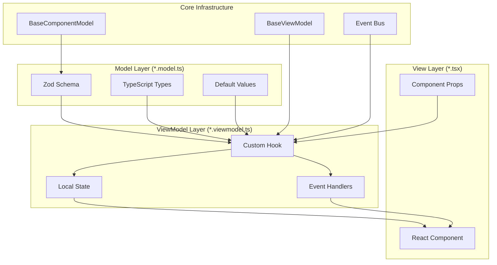

# Ark.Alliance.React.Component.UI

<div align="center">


[


**AI Crawler Compliance:**  


**Enterprise-Grade React Component Library with MVVM Architecture**

*A comprehensive, institutional-quality UI component library designed for multi-domain enterprise applications — including Finance & Trading, Healthcare, Logistics, E-Commerce, AI/ML, Media & Entertainment, Social Platforms, and more — with premium neon aesthetics and complete MVVM separation.*

[📚 Documentation](#documentation) • [🚀 Quick Start](#quick-start) • [🏗️ Architecture](#architecture) • [📦 Components](#component-library)

</div>

---

## 📑 Table of Contents

1. [Executive Summary](#executive-summary)
2. [Solution Structure](#solution-structure)
3. [Architecture Overview](#architecture-overview)
   - [MVVM Pattern](#mvvm-pattern)
   - [Core Infrastructure](#core-infrastructure)
4. [Component Library](#component-library)
   - [Component Categories](#component-categories)
   - [Visual Modes](#visual-modes)
5. [Quick Start](#quick-start)
   - [Installation](#installation)
   - [Usage Examples](#usage-examples)
6. [Showcase Dashboard](#showcase-dashboard)
7. [Testing](#testing)
8. [CI/CD Pipeline](#cicd-pipeline)
9. [Dependencies](#dependencies)
10. [Documentation](#documentation)
11. [Deployment](#deployment)
12. [Contributing](#contributing)
13. [Author & License](#author--license)
14. [Bibliographical References](#bibliographical-references)

---

## Executive Summary

**Ark.Alliance.React.Component.UI** is a production-grade React component library implementing the **Model-View-ViewModel (MVVM)** architectural pattern. Built with React 19, TypeScript 5.9, and Zod 4 for runtime validation, this library provides:

| Feature | Description |
|---------|-------------|
| **47 Component Categories** | Comprehensive UI elements from buttons to 3D charts, org charts, carousels |
| **MVVM Architecture** | Clear separation of concerns with Model, ViewModel, and View layers |
| **Zod Validation** | Runtime type safety with schema-based validation |
| **Premium Aesthetics** | Neon, minimal, and glassmorphism visual modes |
| **Comprehensive Testing** | 782 tests passing (46 test files) with 100% scenario coverage |
| **Enterprise Ready** | TypeScript strict mode, accessibility, responsive design, SEO optimized |
| **Interactive Showcase** | Component explorer with live property controls at `localhost:5173` |

### Business Domains & Industry Verticals

While primarily designed for **large-scale trading and financial applications**, this component library is architected to serve **multiple industry verticals** with specialized component categories:

| Domain | Component Category | Description |
|--------|-------------------|-------------|
| 🏦 **Finance & Trading** *(Primary)* | `Finance/`, `Grids/`, `Charts/`, `Gauges/` | Trading dashboards, portfolio management, market data visualization |
| 🏥 **Healthcare & Medical** | `Medical/` | Patient portals, clinical dashboards, health monitoring |
| 🚚 **Logistics & Supply Chain** | `Logistic/` | Shipping tracking, inventory management, warehouse operations |
| 🛒 **E-Commerce & Retail** | `Basket/`, `Catalogue/`, `PaymentsForm/` | Shopping carts, product catalogs, checkout flows |
| 🤖 **AI & Machine Learning** | `Ia/` | AI dashboards, model monitoring, prediction interfaces |
| 🎵 **Music & Audio** | `Music/`, `Sound/` | Audio players, music libraries, sound visualization |
| 🎬 **Video & Streaming** | `Video/`, `Viewers/` | Video players, media galleries, streaming interfaces |
| 💬 **Social & Communication** | `SocialMedia/`, `Chat/` | Social feeds, messaging, community platforms |
| 💳 **Payments & Fintech** | `PaymentsForm/` | Payment processing, financial transactions |
| 🔐 **Authentication** | `Login/` | Sign-in flows, user authentication, registration |
| 📊 **Data Visualization** | `Chart3D/`, `Charts/`, `Diagram/`, `FlowChart/` | 2D/3D charts, flow diagrams, data analytics |
| 📅 **Scheduling & Events** | `Calendars/`, `DatePicker/`, `TimeLines/` | Calendars, event scheduling, timeline displays |
| 📑 **Content & Documents** | `Documents/`, `Slides/` | Document viewers, presentations, markdown rendering |
| 🏢 **Corporate & CMS** *(v1.2.0)* | `Label/RoleBadge`, `Label/DepartmentBadge`, `TreeView/OrgChart` | Role management, org charts, team hierarchies |
| 🔍 **SEO & AEO Optimization** *(v1.3.0)* | `SEO/Breadcrumb`, `SEO/StructuredDataScript`, `Helpers/seo` | Breadcrumb navigation with Schema.org JSON-LD, structured data injection, SEO helper utilities |
| 🎨 **UI/UX Enhancements** *(v1.5.0)* | `Slides/Carousel`, `TreeView/OrgChart`, `Toast` | Touch gestures, keyboard nav, playback controls, 15 OrgChart tests |

> 📝 **v1.2.0**: Added Corporate CMS components for organization management. See [Library README](./Ark.Alliance.React.Component.UI/README.md#rolebadge-v120) for detailed usage.

> 🔍 **v1.3.0**: Added SEO/AEO components with Schema.org support for search engine optimization and answer engine optimization. Includes `Breadcrumb` with BreadcrumbList schema, `StructuredDataScript` for JSON-LD injection, and comprehensive SEO helpers. Full AI crawler compliance (GPTBot, ClaudeBot, PerplexityBot, Google-Extended). See [SEO Components](#seo--search-engine-optimization-v130) for details.

> 🎨 **v1.5.0**: Major UI/UX enhancements including:
> - **Enhanced Carousel**: Touch/swipe gestures, keyboard navigation (Arrow keys, Space, Escape, Home, End), playback controls with progress bar, loading skeleton, ARIA live announcements
> - **OrgChart Completion**: Full MVVM implementation with 15 passing tests, custom primitives (OrgChartTree, OrgChartConnector), comprehensive 545-line README
> - **Test Suite Improvements**: 782/783 tests passing with suppressed false-positive warnings, clean stderr output
> - **Critical CI/CD Fix**: Removed overly broad `*.json` from .gitignore that was blocking package.json and breaking npm publishing workflow

---

## Solution Structure

```
Ark.Alliance.React.Component.UI/                 # Repository Root
│
├──│ 📦 Ark.Alliance.React.Component.UI/          # Main Component Library (npm: ark-alliance-react-ui@1.5.1)
│   ├── src/
│   │   ├── main.tsx                             # Application entry point
│   │   ├── App.tsx                              # Root component (loads Showcase)
│   │   ├── index.ts                             # Library barrel export
│   │   ├── index.css                            # Global styles + Tailwind
│   │   │
│   │   ├── 🎯 core/                             # Foundation Infrastructure
│   │   │   ├── base/                            # MVVM Base Classes
│   │   │   │   ├── BaseComponentModel.ts        # Base model with Zod schemas
│   │   │   │   ├── BaseViewModel.ts             # Base ViewModel hook
│   │   │   │   ├── FormInputModel.ts            # Form input base model
│   │   │   │   └── useFormInputRestrictions.ts  # Input validation hook
│   │   │   ├── constants/                       # Application constants
│   │   │   └── events/                          # Event bus system
│   │   │
│   │   ├── 🧩 components/                       # Component Library (47 categories)
│   │   │   ├── Buttons/                         # NeonButton
│   │   │   ├── Cards/                           # GlowCard
│   │   │   ├── Gauges/                          # 5 gauge types
│   │   │   ├── Input/                           # 6 input components
│   │   │   ├── Chart3D/                         # 3D visualization (Three.js)
│   │   │   ├── Charts/                          # 2D chart components
│   │   │   ├── Grids/                           # DataGrid, TradingGridCard
│   │   │   ├── Modal/                           # Dialog system
│   │   │   ├── Header/Footer/                   # Layout components
│   │   │   ├── SideBar/                         # Navigation menu
│   │   │   ├── Documents/                       # MarkdownRenderer
│   │   │   ├── TimeLines/                       # Event timeline
│   │   │   └── ... (28 more categories)
│   │   │
│   │   └── 🎨 showcase/                         # Interactive Dashboard
│   │       ├── ShowcaseApp.tsx                  # Main showcase component
│   │       ├── componentRegistry.tsx            # Component definitions
│   │       └── showcase.css                     # Dashboard styles
│   │
│   ├── vite.config.ts                           # Vite build configuration
│   ├── tailwind.config.js                       # Tailwind CSS configuration
│   ├── tsconfig.json                            # TypeScript configuration
│   ├── package.json                             # Library dependencies
│   ├── README.md                                # Library documentation
│   └── CONTRIBUTING.md                          # Contribution guidelines
│
├── 🧪 Ark.Alliance.React.Component.UI.Tests/    # Test Project (782 tests passing)
│   ├── components/                              # Component test suites (46 test files)
│   ├── core/                                    # Core functionality tests
│   ├── Helpers/                                 # Helper/utility tests
│   ├── fixtures/                                # Test utilities & engine
│   ├── setup.ts                                 # Global test setup with error suppression
│   ├── vitest.config.ts                         # Vitest configuration
│   └── README.md                                # Test documentation
│
├── 📱 Ark.Alliance.React.Component.Ui.ShowCases/ # Interactive Showcase Application  
│   ├── src/
│   │   ├── domain/                              # Configuration entities
│   │   ├── infrastructure/                      # Config loader, component resolver
│   │   │   ├── data/                            # Catalogue & panel configs (JSON)
│   │   │   └── wrappers/                        # Component demo wrappers
│   │   └── presentation/                        # UI (pages, components, layout)
│   ├── vite.config.ts                          # Vite configuration
│   └── README.md                                # Showcase documentation
│
├── 📋 .github/
│   ├── workflows/
│   │   ├── node.js.yml                          # Node.js CI
│   │   └── npm-publish.yml                     # NPM publish & release automation
│   └── ISSUE_TEMPLATE/                          # Issue templates
│
└── 📄 LICENSE.txt                               # MIT License
```

---

## Architecture Overview

### MVVM Pattern

The library implements a strict **Model-View-ViewModel** pattern that enforces separation of concerns:

```
┌─────────────────────────────────────────────────────────────────────────────┐
│                              VIEW (*.tsx)                                   │
│  ┌─────────────────────────────────────────────────────────────────────┐   │
│  │  • React Component with forwardRef/memo                              │   │
│  │  • Renders UI based on ViewModel state                               │   │
│  │  • Dispatches user actions to ViewModel                              │   │
│  └─────────────────────────────────────────────────────────────────────┘   │
└─────────────────────────────────────────────────────────────────────────────┘
                                      ▲
                                      │ Uses Hook
                                      ▼
┌─────────────────────────────────────────────────────────────────────────────┐
│                        VIEWMODEL (*.viewmodel.ts)                           │
│  ┌─────────────────────────────────────────────────────────────────────┐   │
│  │  • Custom React Hook (useComponent)                                  │   │
│  │  • State management (useState, useCallback)                          │   │
│  │  • Event handling and business logic                                 │   │
│  │  • Returns { model, state, handlers }                                │   │
│  └─────────────────────────────────────────────────────────────────────┘   │
└─────────────────────────────────────────────────────────────────────────────┘
                                      ▲
                                      │ Extends
                                      ▼
┌─────────────────────────────────────────────────────────────────────────────┐
│                           MODEL (*.model.ts)                                │
│  ┌─────────────────────────────────────────────────────────────────────┐   │
│  │  • Zod Schema definition                                             │   │
│  │  • TypeScript types inferred from schema                             │   │
│  │  • Default values and factory functions                              │   │
│  │  • Extends BaseModelSchema                                           │   │
│  └─────────────────────────────────────────────────────────────────────┘   │
└─────────────────────────────────────────────────────────────────────────────┘
```

### Core Infrastructure

| Core Class | Purpose | Location |
|------------|---------|----------|
| `BaseComponentModel` | Common props: id, disabled, loading, className, testId, ariaLabel | `src/core/base/` |
| `BaseViewModel` | Lifecycle management, state, events, async execution | `src/core/base/` |
| `FormInputModel` | Form input base with validation, restrictions | `src/core/base/` |
| `useFormInputRestrictions` | Input pattern matching, length limits hook | `src/core/base/` |

### Input Validation Rules

The library provides a comprehensive validation system in `src/Helpers/Validators/`:

| Validator | Purpose | Usage |
|-----------|---------|-------|
| `email.ts` | Email format validation | `validateEmail(value)` |
| `text.ts` | Text constraints (min/max length, patterns) | `validateText(value, options)` |
| `common.ts` | Shared validation utilities | Base validation functions |

**Key Features:**
- Zod-based schema validation for all models
- Runtime type checking with clear error messages
- Pattern-based input restrictions (numeric, alphanumeric, etc.)
- Configurable length limits and character filters

#### Data Flow Diagram



---

## Component Library

### Component Categories

| Category | Components | Description |
|----------|------------|-------------|
| **Buttons** | `NeonButton` | Premium button with glow effects and variants |
| **Toggles** | `NeonToggle` | Switch with neon styling and colors |
| **Cards** | `GlowCard` | Status-based card with hover effects |
| **Gauges** | `CircularGauge`, `SpeedometerGauge`, `DigitalGauge`, `BatteryGauge`, `SignalBarsGauge` | Data visualization gauges |
| **Input** | `Input`, `Select`, `TextArea`, `Slider`, `NumericInput`, `FileUpload` | Form inputs with validation |
| **Charts** | `Chart3D` | 3D visualization with Three.js (Cuboid, Cylinder, Bubble, Candle) |
| **Charts 2D** | Various chart components | 2D data visualization |
| **Modal** | `Modal` | Dialog with portal, backdrop, escape handling |
| **ProgressBar** | `ProgressBar` | Linear progress with animations |
| **Header** | `Header` | Visual modes, icons, search, backgrounds |
| **Footer** | `Footer` | Paging controls, slots |
| **Panel** | `Panel` | Container with header/footer slots |
| **GenericPanel** | `GenericPanel` | Universal panel with glassmorphism, gradients, grid overlays, glow effects |
| **Grids** | `DataGrid`, `TradingGridCard` | Data tables and trading cards |
| **SideBar** | `SideBarMenu` | Navigation menu with categories |
| **Label** | `StatusBadge` | Status indicator with pulse animations |
| **Documents** | `MarkdownRenderer` | Render markdown with syntax highlighting |
| **TimeLines** | `Timeline` | Event timeline with customizable display |
| **Tooltip** | `Tooltip`, `withTooltip` | Tooltip component and HOC |
| **Icon** | Icon components | FontAwesome integration |
| **TabControl** | `TabControl`, `TabItem` | Tab navigation with keyboard support |
| **TreeView** | `TreeView`, `TreeNode` | Hierarchical tree with expand/collapse |
| **Carousel** | `Carousel` | Slide carousel with autoplay and navigation |

<details>
<summary><strong>📋 Full Component Category List (40 categories)</strong></summary>

| # | Category | Status |
|---|----------|--------|
| 1 | Basket | 🔄 Planned |
| 2 | Buttons | ✅ Implemented |
| 3 | Calendars | 🔄 Planned |
| 4 | Cards | ✅ Implemented |
| 5 | Catalogue | 🔄 Planned |
| 6 | Chart3D | ✅ Implemented |
| 7 | Charts | ✅ Implemented |
| 8 | Chat | 🔄 Planned |
| 9 | DatePicker | 🔄 Planned |
| 10 | Diagram | 🔄 Planned |
| 11 | Documents | ✅ Implemented |
| 12 | Finance | 🔄 Planned |
| 13 | FlowChart | 🔄 Planned |
| 14 | Footer | ✅ Implemented |
| 15 | Gauges | ✅ Implemented |
| 16 | Grids | ✅ Implemented |
| 17 | Header | ✅ Implemented |
| 18 | Ia | 🔄 Planned |
| 19 | Icon | ✅ Implemented |
| 20 | Input | ✅ Implemented |
| 21 | Label | ✅ Implemented |
| 22 | Login | 🔄 Planned |
| 23 | Logistic | 🔄 Planned |
| 24 | Medical | 🔄 Planned |
| 25 | Menu | 🔄 Planned |
| 26 | Modal | ✅ Implemented |
| 27 | Music | 🔄 Planned |
| 28 | Page | ✅ Implemented |
| 29 | Panel | ✅ Implemented |
| 30 | PaymentsForm | 🔄 Planned |
| 31 | ProgressBar | ✅ Implemented |
| 32 | SideBar | ✅ Implemented |
| 33 | Slides | ✅ Implemented |
| 34 | SocialMedia | 🔄 Planned |
| 35 | Sound | 🔄 Planned |
| 36 | TimeLines | ✅ Implemented (Enhanced) |
| 37 | Toggles | ✅ Implemented |
| 38 | Tooltip | ✅ Implemented |
| 39 | Video | 🔄 Planned |
| 40 | Viewers | 🔄 Planned |

</details>

> 📚 **[View Complete Component Reference Table →](./COMPONENT_REFERENCE.md)**  
> Comprehensive documentation with architecture details, enum consolidation status, and links to individual component READMEs.

### Visual Modes

All components support multiple visual modes for consistent theming:

| Mode | Description | Use Case |
|------|-------------|----------|
| `normal` | Standard appearance | General purpose |
| `neon` | Glowing borders and gradients | Trading dashboards, gaming |
| `minimal` | Reduced visual weight | Clean interfaces |
| `glass` | Glassmorphism with backdrop blur | Modern, premium UIs |

---

## SEO & Search Engine Optimization (v1.3.0)

### Overview

Version 1.3.0 introduces comprehensive **SEO (Search Engine Optimization)** and **AEO (Answer Engine Optimization)** capabilities, enabling applications built with this library to achieve maximum visibility across traditional search engines and modern AI-powered answer engines.

### SEO Components

| Component | Purpose | Key Features |
|-----------|---------|--------------|
| **Breadcrumb** | Navigation trail with Schema.org markup | BreadcrumbList JSON-LD schema, customizable separators, size/variant support, accessible ARIA labels |
| **StructuredDataScript** | JSON-LD schema injection | Multiple schema support, pretty-printing, validation, SSR-compatible |

### SEO Helper Utilities

The `Helpers/seo` module provides type-safe Schema.org JSON-LD generators:

| Helper Function | Schema Type | Use Case |
|-----------------|-------------|----------|
| `generateBreadcrumbListSchema` | BreadcrumbList | Navigation trails |
| `generateOrganizationSchema` | Organization | Company information |
| `generateWebSiteSchema` | WebSite | Site-wide metadata |
| `generatePersonSchema` | Person | Author profiles, team members |
| `generateArticleSchema` | Article/BlogPosting | Blog posts, articles |
| `generateFAQPageSchema` | FAQPage | FAQ sections |

### AI Crawler Compliance

The library is designed for full compliance with AI-powered search and answer engines:

| AI Crawler | Status | Purpose |
|------------|--------|---------|
| **GPTBot** (OpenAI) | ✅ Supported | ChatGPT training data |
| **ClaudeBot** / claude-web (Anthropic) | ✅ Supported | Claude AI training |
| **PerplexityBot** | ✅ Supported | Perplexity AI answers |
| **Google-Extended** | ✅ Supported | Bard/Gemini training |
| **CCBot**, **Bytespider** | ✅ Supported | Common Crawl, general AI |
| **Googlebot**, **Bingbot** | ✅ Supported | Supported | Traditional search engines |

### Usage Example

```tsx
import { Breadcrumb, StructuredDataScript } from 'ark-alliance-react-ui';
import { generateOrganizationSchema } from 'ark-alliance-react-ui/helpers';

// Breadcrumb with automatic Schema.org markup
<Breadcrumb
  items={[
    { key: '1', label: 'Home', href: '/', position: 1 },
    { key: '2', label: 'Projects', href: '/projects', position: 2 },
    { key: '3', label: 'Details', current: true, position: 3 }
  ]}
  baseUrl="https://example.com"
  generateSchema={true}
  size="md"
  variant="default"
/>

// Organization Schema for site-wide SEO
<StructuredDataScript
  schema={generateOrganizationSchema({
    name: 'Your Company',
    url: 'https://example.com',
    logo: 'https://example.com/logo.png',
    contactPoint: {
      email: 'contact@example.com',
      telephone: '+1234567890'
    }
  })}
/>
```

### Architecture: BaseSEOModel

All SEO components extend `BaseSEOModel`, which provides:
- `baseUrl`: Base URL for absolute URL generation
- `generateSchema`: Enable/disable JSON-LD generation
- All `BaseModelSchema` properties (id, disabled, loading, etc.)

```typescript
import { extendSEOSchema } from 'ark-alliance-react-ui/core';

const MyComponentSchema = extendSEOSchema({
  customProp: z.string(),
  // Inherits: baseUrl, generateSchema, id, disabled, etc.
});
```

---

## Quick Start

### Installation

```bash
# Clone repository
git clone https://github.com/ArmandRicheletKleinberg/Ark.Alliance.Trading.Bot-React.git

# Navigate to library
cd Ark.Alliance.React.Component.UI/Ark.Alliance.React.Component.UI

# Install dependencies
npm install

# Start development server (opens at localhost:5090)
npm run dev
```

### NPM Package (When Published)

```bash
npm install @ark-alliance/react-ui
```

```tsx
import { NeonButton, GlowCard, CircularGauge } from '@ark-alliance/react-ui';
import '@ark-alliance/react-ui/styles';
```

### Usage Examples

#### NeonButton

```tsx
import { NeonButton } from '@ark-alliance/react-ui';

<NeonButton 
    variant="primary"
    size="lg"
    visualMode="neon"
    onClick={() => console.log('Clicked!')}
>
    Execute Trade
</NeonButton>
```

#### GlowCard

```tsx
import { GlowCard } from '@ark-alliance/react-ui';

<GlowCard
    title="Trading Status"
    subtitle="Active positions"
    status="success"
    visualMode="neon"
>
    <p>5 open positions</p>
    <p>Total P&L: +$1,234.56</p>
</GlowCard>
```

#### CircularGauge

```tsx
import { CircularGauge } from '@ark-alliance/react-ui';

<CircularGauge
    value={75}
    max={100}
    label="CPU Usage"
    showValue
    colorStart="#00d4ff"
    colorEnd="#7c3aed"
/>
```

---

## Showcase Dashboard

The interactive component explorer is available at **http://localhost:5090**:

```bash
cd Ark.Alliance.React.Component.UI
npm run dev
```

### Features

- **🗂️ Sidebar Navigation**: Browse all component families
- **👁️ Live Preview**: See components with real-time updates
- **🎛️ Property Editor**: Modify props interactively
- **🎨 Style Presets**: Quick apply preset configurations
- **📋 Code Export**: Copy usage code to clipboard
- **📱 Responsive Testing**: View components at different breakpoints

---

## Testing

### Test Project Overview

The **Ark.Alliance.React.Component.UI.Tests** project provides comprehensive coverage for all MVVM components using Vitest and React Testing Library.

| Metric | Value |
|--------|-------|
| **Total Tests** | 233 |
| **Pass Rate** | 100% ✅ |
| **Test Framework** | Vitest ^2.1.8 |
| **Testing Library** | @testing-library/react ^16.1.0 |
| **DOM Environment** | jsdom ^25.0.1 |

### Test Project Structure

```
Ark.Alliance.React.Component.UI.Tests/
├── components/                    # Component test suites (10 files)
│   ├── Button/
│   │   └── Button.test.tsx        # 20 tests
│   ├── Card/
│   │   └── Card.test.tsx          # 11 tests
│   ├── Grids/
│   │   └── TradingGridCard.test.tsx  # 23 tests
│   ├── Icon/
│   │   └── FAIcon.test.tsx        # 16 tests
│   ├── Input/
│   │   ├── BaseInput.test.tsx     # 35 tests
│   │   └── Input.test.tsx         # 12 tests
│   ├── Page/
│   │   └── Page.test.tsx          # 12 tests
│   ├── Panel/
│   │   └── Panel.test.tsx         # 8 tests
│   ├── ProgressBar/
│   │   └── ProgressBar.test.tsx   # 28 tests
│   └── Tooltip/
│       └── Tooltip.test.tsx       # 24 tests
├── core/                          # Core functionality tests (3 files)
│   └── base/
│       ├── BaseComponentModel.test.ts   # 10 tests
│       ├── FormInputModel.test.ts       # 21 tests
│       └── useFormInputRestrictions.test.ts  # 13 tests
├── fixtures/
│   └── ComponentTestEngine.ts     # Scenario-driven test utility
├── setup.ts                       # Test environment setup
├── vitest.config.ts               # Vitest configuration
└── package.json
```

### Test Families & Use Cases

#### 1. Button Components (20 tests)
| Coverage Area | Use Cases |
|---------------|-----------|
| Click Handling | Basic clicks, event propagation |
| Variants | primary, secondary, danger, success |
| Sizes | sm, md, lg |
| States | disabled, loading |
| Accessibility | ARIA attributes, keyboard navigation |

#### 2. Trading Grid Card (23 tests) ✨
| Coverage Area | Use Cases |
|---------------|-----------|
| Status Variants | Idle, Success, Warning, Error, Info |
| Model Validation | Schema parsing, defaults, type safety |
| Theme Support | Dark and light mode rendering |
| Interactions | Click, Enter key, Space key |
| Inheritance | Proper extension of Card base component |

#### 3. Base Input (35 tests) ✨
| Coverage Area | Use Cases |
|---------------|-----------|
| Input Types | text, email, password, number, tel, url |
| Value Changes | onChange events, event object structure |
| Focus/Blur | State management, class application |
| Size Variants | small, medium, large |
| States | error, disabled, readOnly, fullWidth |
| HTML5 Validation | required, maxLength, minLength, pattern |

#### 4. Tooltip (24 tests) ✨
| Coverage Area | Use Cases |
|---------------|-----------|
| Positioning | top, bottom, left, right |
| Delay Timing | 300ms default, 500ms, 1000ms custom |
| HOC Pattern | withTooltip wrapping, optional props |
| Ref Handling | Null ref graceful handling |
| Content | String, empty, long content variants |

#### 5. Progress Bar (28 tests) ✨
| Coverage Area | Use Cases |
|---------------|-----------|
| Percentage | 0%, 50%, 100%, custom ranges |
| Value Clamping | Above max, at minimum |
| Colors | Blue, Green, Red, Cyan, Yellow, Purple |
| Display | showValue, showPercentage, label |
| Animation | Animated vs static modes |

#### 6. Core Functionality (34 tests)
| Coverage Area | Use Cases |
|---------------|-----------|
| FormInputModel | Base schema validation, defaults |
| useFormInputRestrictions | Pattern matching, length limits |

### Test Statistics Summary

> **Last Verified**: 2025-12-28 | **Duration**: 10.86s | **Test Files**: 14 | **All Tests**: 258 ✅

| Test Family | Tests | Pass Rate | Status |
|-------------|-------|-----------|--------|
| BaseInput | 35 | 100% | ✅ |
| ProgressBar | 28 | 100% | ✅ |
| GenericPanel | 25 | 100% | ✅ |
| Tooltip | 24 | 100% | ✅ |
| TradingGridCard | 23 | 100% | ✅ |
| FormInputModel | 21 | 100% | ✅ |
| Button | 20 | 100% | ✅ |
| FAIcon | 16 | 100% | ✅ |
| useFormInputRestrictions | 13 | 100% | ✅ |
| Input | 12 | 100% | ✅ |
| Page | 12 | 100% | ✅ |
| Card | 11 | 100% | ✅ |
| BaseComponentModel | 10 | 100% | ✅ |
| Panel | 8 | 100% | ✅ |
| **TOTAL** | **258** | **100%** | ✅ |

### Running Tests

```bash
# Navigate to test project
cd Ark.Alliance.React.Component.UI.Tests

# Install dependencies
npm install

# Run all tests (watch mode)
npm test

# Run tests once (CI mode)
npm test -- --run

# Run specific test file
npm test -- components/Button/Button.test.tsx

# Run tests with coverage
npm test -- --coverage
```

### Test Architecture: ComponentTestEngine

The test suite uses a **scenario-driven architecture** powered by the `ComponentTestEngine` utility class:

```typescript
import { ComponentTestEngine } from '../fixtures/ComponentTestEngine';

const engine = new ComponentTestEngine();
engine.registerComponent('MyComponent', MyComponent);

const scenario = {
  name: 'Should handle click',
  component: 'MyComponent',
  props: { onClick: vi.fn() },
  actions: [{ type: 'click' }],
  assertions: [{ callback: 'onClick', callCount: 1 }]
};

engine.executeScenario(scenario);
```

#### Engine Features

| Feature | Description |
|---------|-------------|
| **Component Registration** | Register components for consistent testing |
| **Mock Function Creation** | `vi.fn()` integration for callbacks |
| **User Action Simulation** | click, type, hover, focus, blur |
| **Result Validation** | Configurable assertions |
| **Consistent Patterns** | Reusable test scenarios |

### Test Patterns

#### Model Validation Tests
```typescript
describe('ModelSchema', () => {
  it('should parse valid model', () => {
    const result = MyModelSchema.parse({ /* valid data */ });
    expect(result.property).toBe(expectedValue);
  });
  
  it('should use defaults for missing properties', () => {
    const result = MyModelSchema.parse({});
    expect(result.defaultProp).toBe(defaultValue);
  });
});
```

#### Component Behavior Tests
```typescript
describe('Component Behavior', () => {
  it('should handle user interaction', async () => {
    const onClick = vi.fn();
    const { container } = render(
      React.createElement(MyComponent, { onClick })
    );
    
    const element = container.querySelector('.my-element');
    await userEvent.click(element!);
    
    expect(onClick).toHaveBeenCalled();
  });
});
```

#### Visual Variant Tests
```typescript
describe('Visual Variants', () => {
  it('should apply size class', () => {
    const { container } = render(
      React.createElement(MyComponent, { size: 'lg' })
    );
    
    const element = container.querySelector('.my-component');
    expect(element?.className).toContain('my-component--lg');
  });
});
```

### Test Dependencies

| Package | Version | Purpose |
|---------|---------|---------|
| `vitest` | ^2.1.8 | Fast unit test framework |
| `@testing-library/react` | ^16.1.0 | React testing utilities |
| `@testing-library/user-event` | ^14.5.2 | User interaction simulation |
| `jsdom` | ^25.0.1 | DOM implementation for Node.js |
| `zod` | ^3.24.1 | Schema validation testing |

---

## CI/CD Pipeline

### GitHub Actions Workflow

The project uses GitHub Actions for continuous integration:

```yaml
# .github/workflows/node.js.yml
name: Node.js CI

on:
  push:
    branches: [ "master" ]
  pull_request:
    branches: [ "master" ]

jobs:
  build:
    runs-on: ubuntu-latest
    strategy:
      matrix:
        node-version: [18.x, 20.x, 22.x]
    steps:
    - uses: actions/checkout@v4
    - uses: actions/setup-node@v4
      with:
        node-version: ${{ matrix.node-version }}
        cache: 'npm'
    - run: npm ci
    - run: npm run build --if-present
    - run: npm test
```

### Pipeline Features

- **Multi-version Testing**: Node.js 18.x, 20.x, 22.x
- **Automated Builds**: Triggered on push/PR to master
- **Dependency Caching**: npm cache for faster builds
- **Build Verification**: Ensures production builds succeed
- **Test Execution**: All 233 tests run on every commit

---

## Dependencies

### Production Dependencies

| Package | Version | Purpose |
|---------|---------|---------|
| `react` | ^19.0.0 | UI framework (peer dependency) |
| `react-dom` | ^19.0.0 | DOM rendering (peer dependency) |
| `zod` | ^4.0.0 | Schema validation (peer dependency) |
| `@fortawesome/*` | ^7.1.0 | Icon library |
| `@react-three/fiber` | ^9.4.2 | React Three.js renderer |
| `@react-three/drei` | ^10.7.7 | Three.js helpers |
| `three` | ^0.182.0 | 3D graphics library |
| `react-markdown` | ^10.1.0 | Markdown rendering |
| `mermaid` | ^11.12.2 | Diagram rendering |

### Development Dependencies

| Package | Version | Purpose |
|---------|---------|---------|
| `typescript` | ~5.9.3 | Type safety |
| `vite` | ^7.2.4 | Build tool |
| `@tailwindcss/vite` | ^4.1.18 | Tailwind CSS v4 |
| `vite-plugin-dts` | ^4.5.4 | TypeScript declarations |
| `eslint` | ^9.39.1 | Linting |
| `vitest` | ^2.1.8 | Testing framework |

---

## Documentation

### Internal Documentation

| Document | Path | Description |
|----------|------|-------------|
| Library README | [Ark.Alliance.React.Component.UI/README.md](./Ark.Alliance.React.Component.UI/README.md) | Detailed component documentation |
| Test README | [Ark.Alliance.React.Component.UI.Tests/README.md](./Ark.Alliance.React.Component.UI.Tests/README.md) | Test suite documentation |
| Contributing Guide | [Ark.Alliance.React.Component.UI/CONTRIBUTING.md](./Ark.Alliance.React.Component.UI/CONTRIBUTING.md) | Contribution guidelines |
| License | [LICENSE.txt](./LICENSE.txt) | MIT License |

### External References

- **React Documentation**: https://react.dev/
- **TypeScript Handbook**: https://www.typescriptlang.org/docs/
- **Zod Documentation**: https://zod.dev/
- **Tailwind CSS**: https://tailwindcss.com/docs
- **Vite Guide**: https://vite.dev/guide/
- **Three.js Documentation**: https://threejs.org/docs/
- **Vitest Documentation**: https://vitest.dev/

---

## Deployment

### Library Build

```bash
cd Ark.Alliance.React.Component.UI

# Development server
npm run dev

# Production build (application)
npm run build

# Library build (publishable package)
npm run build:lib
```

### Output Structure

```
dist/
├── index.js          # CommonJS bundle
├── index.mjs         # ES Module bundle
├── index.d.ts        # TypeScript declarations
└── style.css         # Component styles
```

### NPM Publishing

```bash
# Build library
npm run build:lib

# Publish to npm (requires npm authentication)
npm publish --access public
```

### Vite Configuration Highlights

- **Library Mode**: Dual ESM/CJS output
- **External Peer Dependencies**: React, ReactDOM, Zod
- **TypeScript Declarations**: Auto-generated via `vite-plugin-dts`
- **Source Maps**: Enabled for debugging
- **Development Server**: Port 5090 with auto-open

---

## Contributing

Please read the [CONTRIBUTING.md](./Ark.Alliance.React.Component.UI/CONTRIBUTING.md) for detailed guidelines.

### Quick Guidelines

1. **Follow MVVM pattern** for all components
2. **Use `extendSchema()`** for models
3. **Include JSDoc documentation** for all exports
4. **Add component to Showcase registry**
5. **Ensure zero TypeScript errors**
6. **Maintain 100% test coverage**

### Component Structure

```
ComponentName/
├── ComponentName.tsx          # View
├── ComponentName.model.ts     # Model (Zod schema)
├── ComponentName.viewmodel.ts # ViewModel
├── ComponentName.module.scss  # Styles (optional)
└── index.ts                   # Exports
```

---

## Author & License

### Author

**Armand Richelet-Kleinberg**  
M2H.IO - Ark Alliance Eco System

- **GitHub**: [@ArmandRicheletKleinberg](https://github.com/ArmandRicheletKleinberg)
- **Email**: contact@m2h.io
- **Website**: https://github.com/ArmandRicheletKleinberg

### License

This project is licensed under the **MIT License** - see the [LICENSE.txt](LICENSE.txt) file for details.

```
MIT License

Copyright (c) 2024 Armand Richelet-Kleinberg

Permission is hereby granted, free of charge, to any person obtaining a copy
of this software and associated documentation files (the "Software"), to deal
in the Software without restriction, including without limitation the rights
to use, copy, modify, merge, publish, distribute, sublicense, and/or sell
copies of the Software, and to permit persons to whom the Software is
furnished to do so, subject to the following conditions:

The above copyright notice and this permission notice shall be included in all
copies or substantial portions of the Software.
```

---

## Bibliographical References

### Architectural Patterns

1. **MVVM Pattern**  
   Microsoft Patterns & Practices. "The MVVM Pattern."  
   https://learn.microsoft.com/en-us/dotnet/architecture/maui/mvvm

2. **React Patterns**  
   Stoyan Stefanov. "React Design Patterns and Best Practices." Packt Publishing, 2017.

### Technologies

3. **React 19**  
   React Team. "React Documentation."  
   https://react.dev/

4. **TypeScript**  
   Microsoft. "TypeScript Handbook."  
   https://www.typescriptlang.org/docs/handbook/

5. **Zod**  
   Colin McDonnell. "Zod: TypeScript-first schema validation."  
   https://zod.dev/

6. **Tailwind CSS**  
   Tailwind Labs. "Tailwind CSS Documentation."  
   https://tailwindcss.com/docs

7. **Vite**  
   Evan You et al. "Vite: Next Generation Frontend Tooling."  
   https://vite.dev/

8. **Three.js**  
   Three.js Authors. "Three.js Documentation."  
   https://threejs.org/

9. **Vitest**  
   Vitest Team. "Vitest: Blazing Fast Unit Test Framework."  
   https://vitest.dev/

### Design Systems

10. **Material Design 3**  
    Google. "Material Design 3 Guidelines."  
    https://m3.material.io/

11. **IBM Carbon Design System**  
    IBM. "Carbon Design System."  
    https://carbondesignsystem.com/

---

<div align="center">

**Built with ❤️ by the Ark Alliance Team**

*Professional UI components for institutional-grade applications*

</div>
